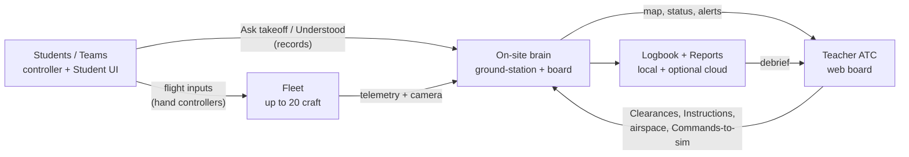

# Poster workflow plan — fulfill the customer diagrams

Source posters (owner, 2026-08-04), eight images in the WhatsApp pack:

1. STEM Drone Mission & Teacher ATC System Overview
2. Communication & Data Flow
3. Suggested Roles & Responsibilities
4. Mission Scenario Overview (Search & Rescue · Delivery · Building Inspection)
5. Teacher ATC Operational Workflow (12 steps)
6. Student Mission Workflow (12 steps)
7. Drone Mission Lifecycle (states + exceptions)
8. Emergency & Exception Handling Flow (6 incident types)

This plan says what the **web app** must do so a Teacher and Students can run that day end to end. Intern hardware columns (Interns 2–4) are out of the web scope except as telemetry consumers. Permanent product rules that intentionally diverge from a poster are listed under **Poster vs product law** — do not “fix” them by implementing the poster literally.

Related: [UI-COMPLETION-PLAN.md](./UI-COMPLETION-PLAN.md) · [ADR-0021](./adr/0021-clearances-and-instructions-are-records-not-commands.md) · [ADR-0025](./adr/0025-the-student-screen-is-a-second-audience-not-a-second-board.md) · [ADR-0019](./adr/0019-the-flight-area-is-drawn-in-the-local-frame.md).

---

## Poster vs product law (do not break)

| Poster says | Product law | Consequence for this plan |
|---|---|---|
| Teacher toolbar includes **Takeoff** as a command to the aircraft | Approve takeoff is a **Clearance** (record to the Student); Students fly by hand ([ADR-0021](./adr/0021-clearances-and-instructions-are-records-not-commands.md)) | UI says **Approve takeoff**, never motors-on from the board |
| Pause / Recall / Emergency Stop to the Fleet | Commands reach the **simulated** Fleet only ([ADR-0011](./adr/0011-commands-reach-the-simulated-fleet-only.md)) | Same buttons; hardware path stays monitoring-only until a later ADR |
| Assign New Target / Reprioritize / Reroute / Add NFZ | **Instructions** or airspace edits — records, not Commands ([ADR-0021](./adr/0021-clearances-and-instructions-are-records-not-commands.md)) | Must appear on Control; must reach Student as words |
| GPS position on the map | Zones and craft in the **Fleet local frame** — no GPS, no map tiles ([ADR-0019](./adr/0019-the-flight-area-is-drawn-in-the-local-frame.md)) | Scope + Student map stay local-frame |
| Student phones join via classroom | One machine today; network join is [#628](https://github.com/ReyAdhitya/techtechflight/issues/628) ([ADR-0025](./adr/0025-the-student-screen-is-a-second-audience-not-a-second-board.md)) | Ship one-machine first; then code sync |
| Student Mission Screen shows live score / ranking while flying | Score is sealed by Teacher and **read back**, never recomputed on the tablet ([ADR-0025](./adr/0025-the-student-screen-is-a-second-audience-not-a-second-board.md)) | Score on land / seal only; in-flight shows objective + vitals |
| Intern 1–4 as app roles | Org chart for the build team, not product audiences | Teacher + Student only in the product |
| Dark ATC cockpit aesthetic | Refused ([DESIGN.md](./DESIGN.md) §1.2) | Paper-and-marigold stays |

---

## System map (posters 1 + 2)



**Web app owns:** Teacher board, Student Mission UI, Logbook/Reports, Mission rules, scoring seal, alert presentation, Scope/zones in local frame.

**Not the web app:** flight controllers, drone firmware, vision/MPU hardware (Interns 2–4). Telemetry arrives via Simulator today; MAVLink monitoring optional ([ADR-0011](./adr/0011-commands-reach-the-simulated-fleet-only.md) / [ADR-0013](./adr/0013-mavlink-stays-in-node.md)).

---

## Roles (poster 3) → product surfaces

| Poster role | Product surface | Must support |
|---|---|---|
| Teacher / ATC Instructor | `/enter` → Lesson · Control · Fleet · Walls · Reports · Settings | Select scenario, airspace, approve takeoff, monitor, incidents, scores/logs |
| Students / Teams | `/enter` → `/student` | Brief, ask takeoff, fly by hand, follow rules, hear ATC, see score after seal |
| Intern 1 (CS) | Builders of the above | Out of runtime product |
| Interns 2–4 | Hardware | Out of runtime product |

Shared poster duties (safety, documentation, testing, scenario refinement, demo prep) map to: Pre-flight seven, Safety brief, Logbook, Reports debrief, Scenario picker — not a fifth role.

---

## Three scenarios (poster 4)

Already seeded in `web/lib/mission-scenarios.ts`. One scenario per Lesson (poster note).

| Scenario | Teacher watches | Student focuses | Judges / risks the board must surface |
|---|---|---|---|
| Search & Rescue | Search progress, route coverage, alerts | Navigation, awareness, safe flight | Target area, safe path, time; miss / battery / obstacle / NFZ |
| Delivery | Route, timing, payload, airspace | Route accuracy, precision, control | Correct destination, stable, timely; wrong dest / drop / battery / route |
| Building Inspection | Distance, inspection completion, alerts | Hover, camera, obstacles | All points, usable camera, safe distance; collision / miss / angle / proximity |

**Gaps to close:**

- Scenario-specific Teacher watch list visible on Control during the run (not only at pick time).
- Scenario-specific Student playbook copy already partly wired via incident playbook + criteria; finish so Delivery never shows Search criteria ([ADR-0018](./adr/0018-a-mission-is-a-first-class-record.md)).
- Payload / inspection-point progress need honest “not measured” when the Fleet is not sending it — never invent.

---

## Teacher ATC workflow (poster 5) — 12 steps → screens

Owner direction (2026-08-06): **no Mission-run left rail**; Lesson is one page for prep; Control is the live board. Steps are a **checklist of work**, not a second nav.

| # | Poster step | Screen | Status today | Work |
|---|---|---|---|---|
| 1 | Select Scenario | **Lesson** (top) | Exists (`ScenarioPicker`) | Keep on one-page Lesson; remove step-gating |
| 2 | Set Mission Area & No-fly Zones | **Lesson** | Exists (`MissionAreaEditor`, local frame) | Keep; live edit of NFZ also from Control toolbar |
| 3 | Assign Teams and Drones | **Lesson** | Exists (`TeamsPanel`); up to Fleet size | Keep; board-order assignment |
| 4 | Pre-flight Check | **Lesson** | Exists (`PreFlightSeven` — battery, props, sensors, link, camera, altitude hold, obstacle) | Keep per craft; do not bury under Scenario |
| 5 | Review Rules & Safety Briefing | **Lesson** | Exists (`MissionBriefing`, `SafetyBriefPanel`) | Keep |
| 6 | Approve Takeoff Requests | **Control** | Exists (`ClearanceQueue`) but easy to miss / empty without teams | Always visible when Mission live; fill queue ([#616](https://github.com/ReyAdhitya/techtechflight/issues/616)) |
| 7 | Monitor live on map | **Control** Scope | Exists | Zones + craft always; strip list = fleet sidebar |
| 8 | Watch telemetry & camera | **Control** strip + Camera | Exists | Selected craft: vitals + Camera dialog; Walls for projector |
| 9 | Issue commands when needed | **Control** | Partial | Toolbar always: **Hover (Pause)**, **Recall**, **Stop**, **Land**; **Add NFZ**, **New Target**, **Reprioritize**, **Reroute** as Instructions ([ADR-0021](./adr/0021-clearances-and-instructions-are-records-not-commands.md)). Poster “Takeoff” = Approve in queue, not a Command |
| 10 | Handle Alerts | **Control** Attention | Exists | Restore always-on Attention (not step-gated); Teacher words |
| 11 | Confirm Mission complete / land | **Control** | Exists (`ConfirmMissionComplete`, pack-down) | Always reachable at end of period — not behind step 11 only |
| 12 | Review logs, scores, debrief | **Reports** | Exists | Mission on the Lesson; scores; CSV/PDF; tighten empty states |

**Teacher monitoring panel (poster sidebar) — always on Control:**

- Craft positions (Scope)
- Group / team list (strips + assignment)
- Battery levels (strips)
- Flight status (strips + Status vocabulary — keep Status ≠ FlightPhase ≠ MissionPhase, [ADR-0020](./adr/0020-three-state-vocabularies.md))
- Mission / No-fly zones (Scope)
- Alert list (Attention)

---

## Student Mission workflow (poster 6) — 12 steps → phases

Student UI stays **one screen that changes with phase** ([ADR-0025](./adr/0025-the-student-screen-is-a-second-audience-not-a-second-board.md)): landscape, full width, one dominant thing, exactly **Ask to take off** and **Understood**.

| # | Poster step | Student phase / UI | Status | Work |
|---|---|---|---|---|
| 1–2 | Brief + objective / rules / time / checkpoints | Brief (objective largest) | Shipped | Keep; time limit from Scenario / Mission clock |
| 3 | Prepare drone / controller / app | Pre-flight seven for **their** craft | Partial | Show their craft’s seven; Teacher ticks still authoritative |
| 4 | Connect and check status | Link / craft presence | Shipped (“board and craft actually there”) | Keep age of last reading; no invented GPS |
| 5 | Request takeoff | Ask to take off | Shipped | Keep |
| 6 | Take off after approval | Cleared → flying on `flownAt` | Shipped | Held is its own phase |
| 7 | Fly route / checkpoints | Flying + map | Shipped map read-only | Next checkpoint dominant when it matters |
| 8 | Avoid obstacles / NFZ | Warnings full-width | Partial | Breach / playbook copy |
| 9 | Respond to Teacher instructions | Instruction + Understood | Partial / issues open | Surface New Target / Reroute / Reprioritize / Hold as poster step 9 |
| 10 | Complete mission task | Complete cue | Partial | From Teacher seal / task evidence — not a Student button |
| 11 | Return home / land | Landing phase from Telemetry | Shipped via `flownAt` | Keep |
| 12 | Review score and feedback | Score after seal | Shipped | Criteria = Scenario’s judges only |

**Student Mission Screen must show (poster sidebar):**

| Element | Rule |
|---|---|
| Mission objective | Dominant before takeoff |
| Map | Own craft + zones + own checkpoints; local frame |
| Checkpoints | Next + progress |
| Timer | Remaining time (not a static limit wearing a countdown’s name) |
| Battery | From Fleet only; else “Not reporting” |
| Score | After seal only |
| Warnings | Full width or absent |

**What if (poster contingencies)** — already sketched in incident playbook; finish copy for:

| Situation | Student sees |
|---|---|
| Low battery | Follow ATC; return / land |
| Obstacle ahead | Adjust route |
| New target assigned | Confirm Understood; continue |
| Missed checkpoint | Follow ATC; re-route |

---

## Mission lifecycle (poster 7) → state model

Map poster states onto existing vocabularies — **do not invent a fourth**:

| Poster state | Product home |
|---|---|
| Standby / Idle | Status + grounded Telemetry |
| Pre-flight / Ready | PreFlightSeven + Status usable |
| Await takeoff / Holding | Clearance `requested` / `held` |
| Takeoff / Ascending | FlightPhase + `flownAt` set |
| Climb / Stabilize | FlightPhase |
| In Mission / Active | Mission under way + airborne |
| Checkpoint progress | Checkpoint records / Scope |
| Task complete | Mission outcome path |
| Return home / Landing | Command Recall (sim) or Student flies home; FlightPhase |
| Mission finished | Teacher seal + Reports |

**Exception strip (orange) → Teacher Instructions / Alerts + Student Understood:**

Paused/Hold · New Target · Reprioritized · Obstacle · Low battery · NFZ · Lost link

**Critical (red):** Emergency recovery (Stop / Land / Recall on sim) · Crash / Failed → incident log, mission end path.

Continuous telemetry the board must show when active: battery, position (local), altitude, speed, camera — already the strip + Camera path.

---

## Emergency & exception matrix (poster 8)

Six columns × six rows. Web app owns **Server / ATC System**, **Teacher**, **Student** rows. Drone row is hardware/sim behaviour.

| Incident | Board detects | Board does | Teacher UI | Student UI | Outcome to log |
|---|---|---|---|---|---|
| 1 Low battery | Threshold vitals | Alert; suggest RTH | Ack; approve land / Recall | Playbook; prepare pad | Safe land; mission may end |
| 2 No-fly warning / violation | Airspace breach | Alert; suggest reroute | Pause / Reroute / override as Instruction | Confirm reroute | Stay outside; continue |
| 3 Obstacle | Sensor / sim event | Log; path options | Approve reroute / caution | Confirm | Avoided; continue |
| 4 Lost link | Telemetry age | Lost-link alert; last known | Restore / confirm failsafe | Stand by; visual | Resume or RTH or retrieve |
| 5 Missed target / route | Checkpoint / route tolerance | Record miss; next target | Retry / new route / adjust | Prepare retry | Continue or adjust |
| 6 Crash / hard landing | Impact / abnormal (sim or report) | Crash alert; lock flight record | Stop mission; secure area | Do not approach | Incident logged; mission ended |

**Safety priorities (footer) → product order of Attention:**

1. People safety  
2. Airspace compliance  
3. Drone recovery  
4. Mission completion  
5. Logging & review  

Attention queue sort must respect that order (people/airspace before “mission niceties”).

---

## Gap scoreboard (honest)

| Area | ~Coverage | Biggest holes |
|---|---|---|
| System overview / data flow | Medium | Classroom code sync (#628); poster “Takeoff” command confusion in UI copy |
| Roles | High | Door copy oversells phones; no role switch |
| Three scenarios | High | Live Teacher watch-list; measured vs not-measured progress |
| Teacher 12 steps | Medium–High | Step-rail gating hides live board; clearance empty; Instruction toolbar not one strip |
| Student 12 steps | Medium–High | Step 9 instructions; contingency polish; cross-device |
| Lifecycle states | Medium | Align labels on strips with poster words without collapsing Status/FlightPhase/MissionPhase |
| Emergency matrix | Medium | Six-column playbooks incomplete; crash path; lost-link Teacher script |

---

## Delivery waves

Each wave is a PR-sized ship. Conventional commits. Update CHANGELOG + DECISIONS. Do not reintroduce a Mission-run left rail.

### Wave A — Layout that matches the posters (Lesson + Control)

**Goal:** Teacher can do steps 1–5 on one Lesson page; steps 6–11 always available on Control without `?step=`.

1. Remove `StepRail` from Lesson and Control; supersede ADR-0024.
2. Lesson = single scroll: Scenario → Zones → Teams → Pre-flight → Brief/Safety → Start/End period (Fleet health one line).
3. Control = always: Attention → Clearance queue (if Mission) → Scope → fleet Commands → strips → Instructions → Confirm complete + pack-down.
4. Fix empty clearance queue (#616); Lesson cold-open (#648).

**Done when:** a Teacher runs prep → approve → fly → seal without touching a step number.

### Wave B — Teacher ATC toolbar (poster Control bar)

**Goal:** Bottom (or fixed) action strip matches the poster’s six intents, under ADR-0021 naming.

| Poster button | Ship as |
|---|---|
| Takeoff | Deep-link / focus **Approve takeoff** queue (not Command) |
| Pause | Command `hold` (Hover) |
| Recall | Command `return-home` |
| Add NFZ | Airspace edit on Scope |
| New Target | Instruction (`AssignTargetControl`) |
| Reprioritize | Instruction |

Also expose **Reroute**, **Emergency Stop**, **Land** (already on strips / fleet actions). Selected craft + fleet-wide where DESIGN already allows.

**Done when:** every poster Teacher action is one press away during a live Mission, with the right kind (Command vs record).

### Wave C — Student poster completion

**Goal:** Student 12-step story without adding pressables.

1. Instruction phase (step 9): New Target / Reroute / Reprioritize / Hold → full-width + Understood.
2. Contingency cards for the four “what if” situations with Teacher-words only.
3. Honest door copy; role switch; then #628 `/api/classroom` join-by-code.
4. Scenario criteria on score screen only for that Scenario’s judges.

**Done when:** Student day matches poster 6 on one machine; then on a second device.

### Wave D — Scenario & lifecycle fidelity

**Goal:** Posters 4 + 7 feel true in the live run.

1. Control shows “Teacher watches” for the active Scenario.
2. Checkpoint / delivery / inspection progress: measured or “Not measured”.
3. Strip / Attention vocabulary aligned with lifecycle words where it helps Teachers, without merging ADR-0020 vocabularies.
4. Mission clock / time-limit pressure visible to Teacher and Student.

### Wave E — Emergency matrix completeness

**Goal:** Poster 8 rows for Server / Teacher / Student are implemented for all six columns.

1. Playbook entries + Attention severity for each column.
2. Student copy per column.
3. Crash / hard-landing path: stop recording, secure messaging, incident on Lesson, mission end.
4. Lost-link: last known on Scope, failsafe status wording.
5. Every incident writes a Logbook / Reports-visible trail.

### Wave F — Debrief & demo (poster step 12 + shared duties)

**Goal:** After landing, Teacher can debrief from Reports without hunting.

1. Mission scores beside Lesson; team comparison.
2. Alert timeline for the period.
3. Export / print already present — tighten empty states (#586).
4. Demo prep checklist optional on Lesson (shared duty “Demo preparation”) — only if owner wants it in-product.

---

## Suggested PR sequence

```
A  refactor(ui): one-page Lesson; Control always-on live board (kill step rail)
B  feat(control): Teacher ATC toolbar matching poster intents (ADR-0021 kinds)
C  feat(student): instructions + contingencies + honest join path
D  feat(mission): scenario watch-list + measured progress + clock
E  feat(alerts): six-column emergency matrix end to end
F  feat(reports): debrief pack for sealed Missions
```

---

## Definition of done (whole plan)

A classroom can:

1. Pick **one** of the three scenarios and draw zones.
2. Assign teams/craft, tick pre-flight, brief safety.
3. Start the period; Students ask; Teacher approves.
4. Teacher monitors Scope + strips + camera; acts with Hover / Recall / Stop / NFZ / Target / Reprioritize / Reroute.
5. Alerts for all six incident types produce Teacher + Student paths and a log line.
6. Teacher seals the Mission; Students see score; Reports holds the debrief.

Without: GPS tiles, Student Commands to motors, invented telemetry, a Mission-run left rail, or Intern role logins.

---

## Scoreboard

| Wave | Status | Notes |
|---|---|---|
| A Layout | done | One-page Lesson; Control always-on; StepRail unmounted; ADR-0024 superseded |
| B Toolbar | done | `TeacherAtcToolbar` — Approve / Pause / Recall / Stop / NFZ / Target / Reprioritize / Reroute |
| C Student | done | Join-by-code door; `/api/classroom`; role switch; instructions push to session |
| D Scenario / lifecycle | done | `ScenarioWatchList` + mission clock words on Control |
| E Emergencies | done (base) | Playbook already covers six poster columns; Attention always-on + Teacher words |
| F Debrief | done | Reports Debrief list of sealed scores |
