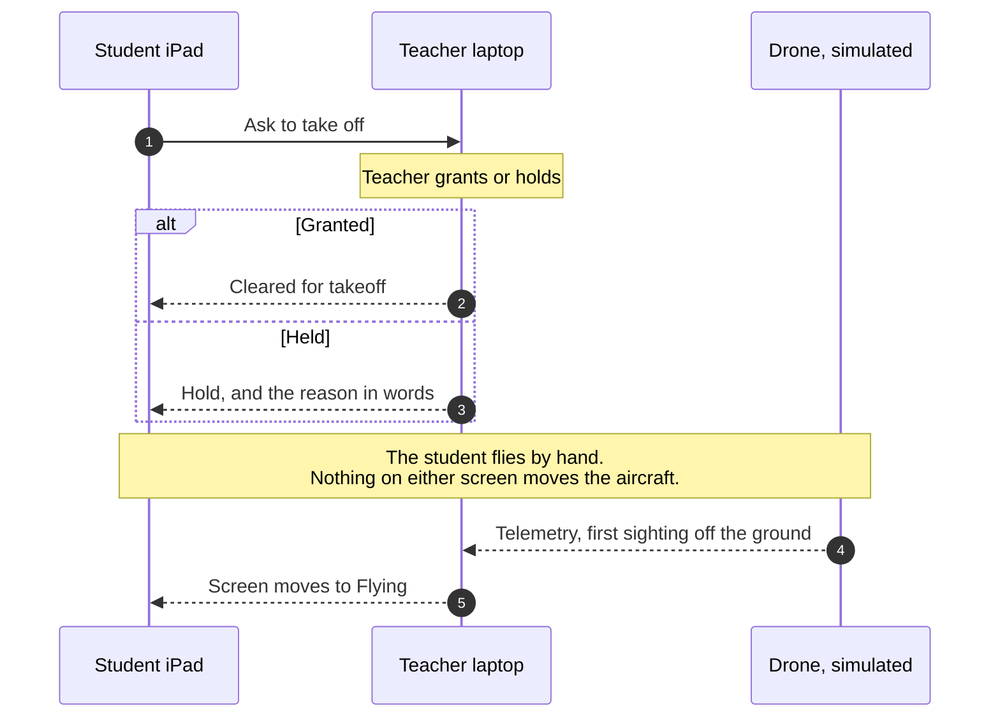
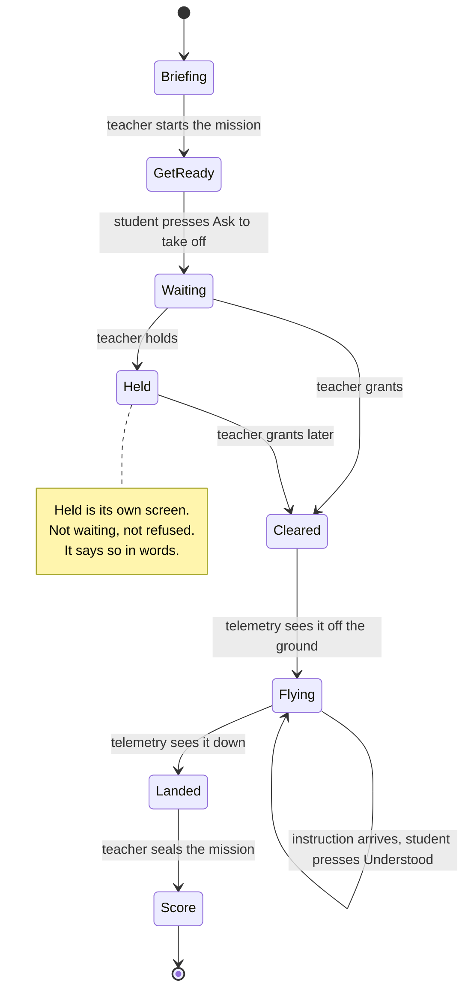

# The rail comes back, and the demo runs on Vercel

Handover, 2026-08-07. Written by the planner terminal. Everything here was decided by
the product owner in conversation on 2026-08-06 and 2026-08-07, and every fact about the
code was checked against `main` rather than remembered.

This supersedes the priority order in
[`2026-08-06-what-is-left.md`](./2026-08-06-what-is-left.md). That document named the
ground station `/api/classroom` gap as the top blocker. It is not a blocker for this
demo, because the demo runs on the Vercel deploy. It stays true for a real classroom.

## 1. The decisions

1. **The artifact wins.** The twelve-step rail comes back. The prototype is the spec:
   <https://claude.ai/code/artifact/a17e27e0-b6d8-44da-a424-95066847314c>
2. **One page holds all twelve steps.** `/lesson`, `/control` and `/reports` stop being
   separate destinations for the Mission run.
3. **The nav collapses to one button.** Two navigations on one screen is the confusion
   being removed. The rail is the only navigation while a Lesson runs.
4. **Vercel for now.** This is a demo for the owner's boss, not the real classroom.
5. **The demo is** a Teacher laptop plus one iPad, with the simulated Fleet in the browser.
6. **UML is two diagrams**, in Mermaid, and they belong in the coder's prompt.

### The rule that was blocking all of this

`CLAUDE.md` carries this line, and every agent reads it before touching anything:

> do not re-mount `StepRail` without a new ADR

ADR-0024 was superseded on 2026-08-06 to remove the rail. The owner has reversed that
decision. Until the line changes, an agent reading `CLAUDE.md` will refuse the work and
explain why the one-page design is better. That is why this kept failing. It was not
stubbornness, it was the rulebook.

**The coder's first commit rewrites it.** Nothing else starts before that.

## 2. The plan

| # | What | Who | Where |
|---|---|---|---|
| 1 | Reverse the rail decision in `CLAUDE.md` and ADR-0024 | coder, commit 1 | Prompt 1 |
| 2 | The two diagrams | planner, done | Section 5 |
| 3 | Build the rail and the twelve steps | coder | Prompt 1 |
| 4 | Review it against the artifact | reviewer | Prompt 2 |
| 5 | ~~Switch on Vercel Blob so iPads can join~~ | done | verified 2026-08-07, see section 8 |
| 6 | Rehearse on the real laptop and the real iPad | **the owner** | not automatable |

### The cut line if the demo is close

One branch, one pull request, roughly five commits:

1. The new ADR plus the `CLAUDE.md` fix
2. The rail itself, three phases, lock reasons
3. Steps 1 to 5 onto the one page
4. Steps 6 to 10, the live half
5. Steps 11 and 12, plus Hold beside Grant

**If the demo is days away, stop after commit 4.** Steps 11 and 12 are the debrief and a
demo rarely reaches them.

## 3. Prompt 1: the coder terminal

```
You are the engineer on TechTech Flight, a ground station board for a school
teacher running a class of drones. Repo: D:\techtechflight, branch main at
5290f37. Read CLAUDE.md, docs/DESIGN.md, CONTEXT.md and design.md first.

THE JOB

Make the Teacher side of the app match this prototype, screen by screen:
  https://claude.ai/code/artifact/a17e27e0-b6d8-44da-a424-95066847314c
A full local copy is already saved here, read it rather than refetching:
  C:\Users\reyse\.claude\projects\D--techtechflight\798f3153-721a-405e-a230-a6ce1b59e6bb\tool-results\artifact-a17e27e0-1785837251-fb81.html
It is a working HTML prototype using this product's own tokens. Its copy is
the spec. Do not paraphrase it.

READ THIS BEFORE YOU ARGUE WITH THE TASK

CLAUDE.md currently contains this line:
  "do not re-mount StepRail without a new ADR"
and ADR-0024 was superseded on 2026-08-06 to remove the rail. That decision
has been reversed by the product owner. The rail is the product. Your FIRST
commit is to write the new ADR that reverses it and to rewrite that gotcha,
before you touch any component. Do not skip this and do not implement around
it. If you find yourself explaining why the one-page design is better, stop:
that argument has been had and the owner ruled against it.

SCOPE

1. One page holds all twelve steps. /lesson, /control and /reports stop being
   separate destinations for the Mission run. Old routes should still resolve,
   not 404.
2. The step rail is the only navigation on that page. Three phases:
   Set up 1-5, In the air 6-10, Close down 11-12.
3. Every step carries a done string and a lock reason. From the prototype:
     1  Mission Scenario      done "Search and Rescue"   lock none
     2  Mission area          done "1 zone, 2 no-fly"    lock "Choose a Scenario first"
     3  Teams and Drones      done "4 teams, 3 craft"    lock "Draw the Mission Zone first"
     4  Pre-flight check      done "2 of 3 past it"      lock "Put a team on a craft first"
     5  Rules and brief       done "3 of 5 ticked"       lock "Pre-flight one craft first"
     6  Takeoff clearance     done "2 waiting"           lock "Brief the class first"
     7  Where everything is   done "3 airborne"          lock "Grant a takeoff first"
     8  Telemetry and camera  done "Kestrel selected"    lock "Grant a takeoff first"
     9  Commands              done "Nothing sent yet"    lock "Grant a takeoff first"
     10 Alerts                done "1 critical"          lock "Grant a takeoff first"
     11 Mission complete      done "1 still airborne"    lock "Nothing has flown yet"
     12 Logs and debrief      done "Sealed 09:44"        lock "Seal the Mission first"
   Steps 7 to 10 read as live while the class is up, not as things a Teacher
   ticks off. They settle to done when the Mission is sealed.
   web/lib/mission-flow.ts already models done/current/live/locked. Reuse it.
   web/components/StepRail.tsx exists and is imported by nothing. Start there.
4. The seven-item nav in web/components/SiteNav.tsx collapses behind one
   button. Lesson, Control and Reports leave it, since they are now steps.
   Fleet, Walls, Students and Vision stay reachable from that button. Settings
   stays on its own control. Two navigations on one screen is the thing we are
   removing.
5. Step 6 needs Hold beside Grant. holdClearance does not exist; write it
   beside grantClearance in web/lib/clearance.ts. A hold is a record and is
   never a Command. The Student must read the hold in words.
6. Do not regress the Student app. StudentMissionScreen.tsx and the classroom
   join shipped this week and work.

RULES THAT DO NOT BEND

- Students never get a Command. Land, Hover, Recall, Auto-land and Stop are
  the Teacher's, always. ADR-0011 and ADR-0021.
- Phases come from records and Telemetry, never from a button press. flownAt
  is the first sighting off the ground. held is its own phase.
- No GPS, no map tile. Position is metres from the Fleet's own origin, ADR-0019.
- No invented readings. An absent value is said in words, never a zero or a
  dash dressed up as live.
- No em dashes and no middots in anything a Teacher or Student reads. Rewrite
  the sentence, do not delete the character. Commit 898af04 broke a build
  doing exactly that; read 898af04, 541c9be and dfebeb3 before touching copy.
- Semantic colour tokens only: bg-canvas, text-ink-subtle, border-hairline.
  Never the shadcn base layer. A px font-size is a defect, ADR-0008.

OUT OF SCOPE, DO NOT DO THESE

- The ground station server, the LAN address, the Windows firewall rule. This
  demo runs on Vercel with the browser simulator, NEXT_PUBLIC_DEMO_ONLY=1.
- Real drone or MAVLink work.
- Sweeping em dashes out of JSDoc comments. Nobody reads those.

THE GATE

npm test and npm run typecheck. That pair is the whole of CI. There is no lint.
jsdom cannot see layout, so a broken rail passes green. Before you claim a
visual fix works: build, then run scripts/shot.mjs <label> <route> <width>
from PowerShell, not Git Bash, and look at the image.

HOW TO WORK

Own git worktree, own branch, conventional commits, one logical change each.
If the commit subject needs the word "and", it is two commits. Rebase, do not
squash. Push and open a PR. Update docs/CHANGELOG.md and docs/DECISIONS.md
before you finish.

If the spec and the prototype disagree, the prototype wins. If the prototype
and a safety ADR disagree, stop and ask. Do not decide that one yourself.
```

## 4. Prompt 2: the front end reviewer terminal

```
You are the front end reviewer on TechTech Flight. You comment. You never
commit and you never push.

WHAT YOU ARE REVIEWING AGAINST

The branch that rebuilds the Teacher flow around the twelve-step rail, against
this prototype:
  https://claude.ai/code/artifact/a17e27e0-b6d8-44da-a424-95066847314c
Local copy, read this one:
  C:\Users\reyse\.claude\projects\D--techtechflight\798f3153-721a-405e-a230-a6ce1b59e6bb\tool-results\artifact-a17e27e0-1785837251-fb81.html
Read CLAUDE.md, docs/DESIGN-TOKENS.md, design.md and docs/DELIBERATE-POSITIONS.md
before you form an opinion.

The audience is a teacher standing in front of a class of children flying
drones. They glance at this screen. They do not study it.

LOOK AT PICTURES, NOT AT TESTS

The whole suite is jsdom, so a broken flex axis, a wrong aspect ratio and an
off-screen rail all pass green. Build first, then:
  scripts/shot.mjs <label> <route> <width>
Run it from PowerShell. Git Bash rewrites a bare /route into a Windows path.
Shoot at least 1280 and 1024 wide, and shoot the dark theme. Do not report a
visual verdict you have not seen an image for.

CHECK THESE SPECIFICALLY

1. The rail. Are the three phases there, Set up, In the air, Close down. Do
   locked steps say why they are locked, in the prototype's own words, not a
   generic "unavailable". Do steps 7 to 10 read as live rather than as ticked.
2. One navigation. If the seven-item nav and the twelve-step rail are both on
   screen competing, that is the defect this whole change exists to remove.
3. Copy. Compare wording against the prototype line by line. No em dashes, no
   middots, anywhere a Teacher or Student reads. Check the words are the ones
   in CONTEXT.md: Mission, Mission Scenario, Fleet, Drone, Lesson. Sortie,
   pilot, callsign and UAV are banned.
4. Tokens. Semantic layer only, bg-canvas, text-ink-subtle, border-hairline.
   Any raw hex or any px font-size is a defect, ADR-0008. Grep for both.
5. Step 6. Grant and Hold both present, both reachable without selecting
   anything first. A held team must read as held, not as still waiting.
6. Nothing on the Student side regressed. Exactly two pressable things in the
   whole Student app: Ask to take off, and Understood. If a third appeared,
   that is a stop-the-line finding, ADR-0025.
7. No invented readings. Any figure the Fleet is not sending must be absent in
   words, never a zero and never a dash.
8. Print and dark theme. Dark semantic tokens stay light-on-white unless
   @media print resets them. See ReportsScreen.test.tsx.
9. Keyboard and focus. The rail is navigation. It must be reachable and
   visibly focused without a mouse.

WHAT NOT TO RAISE

- docs/DELIBERATE-POSITIONS.md lists six things that look like bugs and are
  not: tiles never reorder, counts render at zero, elevation is lightness
  only, the amber and coral hue split. Argue with those in an ADR or leave
  them alone.
- The rail itself. Whether it should exist has been decided by the owner. Do
  not reopen it.
- JSDoc em dashes. On-screen copy only.

HOW TO REPORT

Run /code-review for the standards and spec pass, then add your own visual
findings on top with the screenshots attached. Severity first. For each
finding: what you saw, which file and line, and what it should be instead.
Say plainly when something is a matter of taste rather than a defect.
```

## 5. The two diagrams

Paste these into the coder's prompt under `THE JOB`.

### What happens when a Student asks to take off



The point is the last two arrows. The Student's screen advances because the craft was
seen off the ground, not because anyone pressed anything.

### What the Student screen shows, and what changes it



Eight screens, and only two presses exist in the whole Student app. Neither press moves
the Student to the next screen.

A third diagram is not worth drawing. The Teacher's twelve steps and their locks are
already a table in Prompt 1, and a table is easier to build from than a picture.

## 6. Where the posters and the app disagree

Three differences, all deliberate, all recorded. A boss who drew those posters will
notice them. Have one sentence ready for each before the demo.

| The poster shows | The app does | Why |
|---|---|---|
| A green map with trees, buildings and a pitch | A plain grid in metres from the Fleet's own origin | There is no GPS. A zone drawn in the local frame stays correct even when the origin is wrong. ADR-0019 |
| "Position (GPS)" in the telemetry list | No GPS anywhere | Same. No map tile, no network in this feature, deliberately |
| Step 9 issuing Pause, Recall, Add No-fly Zone, Assign New Target, Reprioritise as commands | Only Land, Hover, Recall, Auto-land and Stop reach a craft. The rest are records | The Students fly by hand. There is no autopilot to send an instruction to. ADR-0021 |

## 7. One real gap

The Emergency and Exception Handling poster lists six incidents. `web/lib/incident-playbook.ts`
carries nine entries: emergency-stop, crash, separation, no-fly, fault, low-endurance,
battery-low, obstacle, no-response.

**"Missed Target / Route Error" has no entry.** If the boss walks that poster row by row,
that row has no answer in the app.

## 8. Checked today, so nobody re-derives it

- The Student screen already shows Score, Checkpoints, Battery, Time left, the map and
  warnings, which matches the "What you can see" panel on the Student poster
- `MAX_CLASSROOM_FLEET_SIZE` is 20, which matches the "up to 20 drones" claim on both
  architecture posters
- `holdClearance` does not exist anywhere in `web/lib`
- `web/components/StepRail.tsx` exists and nothing imports it but its own test
- `web/app/(app)/lesson/page.tsx` still reads `?step=` on the client
- The full suite was green on 2026-08-06: 1421 tests across 232 files
- **The Vercel classroom store is already live.** `BLOB_READ_WRITE_TOKEN` exists on the
  `techtechflight` project across Production, Preview and Development, created
  2026-08-06. `GET https://techtechflight.vercel.app/api/classroom?code=TEST` answers
  `HTTP 200` with a stored session labelled `probe`, so reads and writes both work. The
  iPad join path is not blocked. Re-check with that one URL if it ever looks broken: a
  reply of "Classroom store is not configured" means the token went missing

## 9. Still open

- **The demo date.** Everything here assumes days rather than weeks. With weeks, the
  coder does all five commits instead of stopping after four.
- **The Student side has no artifact.** The poster is its spec. If the owner has a
  picture in mind that is not on the poster, it needs saying before the coder starts.
- **A rehearsal on the real iPad.** The classroom API answers correctly, which is not the
  same as a child joining a lesson on a tablet and reading the right thing. Nothing here
  has been through that.
