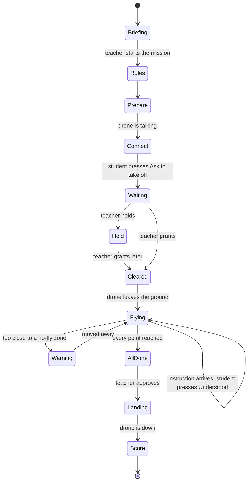

# Where everything stands, 2026-08-07

The full picture after the rail shipped, the front end review came back, and the Student
half was designed. Written by the planner terminal. Every code claim here was checked
against `main`, not remembered.

Companion documents:
[the rail handover](./2026-08-07-rail-rebuild-handover.md) ·
[the triage](./2026-08-06-what-is-left.md)

## 1. What shipped today

**PR #653 merged and deployed.** The Mission run is now one page at `/mission` with the
twelve-step rail on it. Ten commits, 42 files. ADR-0026 reverses the ADR-0024 supersession
that removed the rail.

Live at `https://techtechflight.vercel.app/mission`.

Also settled today, with evidence:

- **The Vercel classroom store was already live.** `BLOB_READ_WRITE_TOKEN` has been on the
  project since 2026-08-06 and `/api/classroom` answers `HTTP 200`. iPads can join.
- **`vercel.app` is blocked by the owner's ISP in Indonesia.** Nothing opens without a VPN,
  on any device. This is not an app fault. The fix is a custom domain.
- **`flight.techtechtechnology.com` is attached to the project and ownership is verified.**
  It needs one CNAME record at Cloudflare to go live:
  `flight` → `ebcdfbdb43322afe.vercel-dns-017.com`, proxy off. Only the owner can add it.
- **Vercel SSO protection is currently off** so previews open on a tablet. Put it back with
  `vercel project protection enable techtechflight --sso` after the demo.

## 2. The front end review, graded

The reviewer's headline finding is **wrong**, and it matters that this is recorded, because
they wrote "I verified this one myself".

> **Claimed:** `ControlScreen.tsx:445-452` builds `carried` through `grantSeatsForDrone` and
> `holdSeatsForDrone` and never calls `writeClassroomSession`, so a Teacher's grant never
> reaches the child's tablet.
>
> **Actually:** `grantSeatsForDrone` → `grantSeatClearance` → `updateSeatPhase` →
> `writeClassroomSession`, which writes `localStorage`, broadcasts to other tabs, **and
> pushes to the cloud immediately**. The answer does reach the tablet.
>
> What is really there is a **dead `carried` assignment** sitting directly under a comment
> describing that exact bug. It is a trap, not a defect. Delete it.

### Confirmed real

| # | Finding | Where |
|---|---|---|
| 1 | **Step 11 locks instead of refusing.** `isMissionStepOpen(11)` closes while anything is airborne, so `StepSurface` never mounts and the prototype's Recall and Land have no buttons | `mission-flow.ts:264` |
| 2 | **`/reports` dead-ends.** Forwards to `/mission?step=12`, gated on `facts.sealed`. On any day with nothing sealed there is no route to the digest, export or past Lessons | `reports/page.tsx:11` |
| 3 | **A 60 second overlay can cover a live board.** The Warm-up is gated on `sessionStorage`, so a new tab mid-lesson replays it over a running Mission | `LessonScreen.tsx:239` |
| 4 | **Step 8's done string is hardcoded absent.** `selectedCraftName: null` means it can only ever read "No craft selected", and a test asserts 'Kestrel', an unreachable state | `MissionRunScreen.tsx:117` |
| 5 | **The rail argues with itself.** A tick beside "No teams yet", because `missionCraftIds` falls back to `mission.droneIds` when teams are empty | `mission-flow-facts.ts:47-56` |
| 6 | **Keyboard cannot reach the rail on live steps.** `scrollIntoView` on mount moves the sequential-focus start; the rail is not reached in 40 tab presses | `ControlScreen.tsx:181` |
| 7 | **Copy drift.** "Grant clearance" where the prototype says "Grant takeoff" | `ClearanceQueue.tsx:146` |
| 8 | **Two layout invariants untested.** `SiteNav` and `MissionRunScreen` have no stylesheet assertion, so deleting a CSS rule ships a permanently open panel with every test green | their test files |
| 9 | **One raw colour literal** in a component rule, the scrim | `globals.css:917` |

### Verified clean by the reviewer

One navigation only, three phase labels correct, locked steps say why in the prototype's own
words, steps 7 to 10 read live and never ticked, zeros said in words, dark theme correct at
both widths, narrow drawer works with no horizontal overflow.

### Not caused by this change

React error #418 on every role-gated route, and `data-theme` reading null after hydration.
Both predate the rail. `CLAUDE.md` already records the second.

### A contradiction that was the planner's fault

"Match the prototype line by line" and "no middots" cannot both hold, because the prototype
is full of middots. The build took the words and dropped the middots. That is the right call
and the copy should not be graded character for character against the prototype.

## 3. What the owner found, looking at the running board

All four confirmed in code.

1. **The lesson name is asked twice on one page.** `LessonPrepPanel.tsx:55` says "Lesson
   name" with **Save plan**; `LessonScreen.tsx:204` says "What is this lesson?" with
   **Start the lesson**. One has to go.
2. **There is no way back after Start.** `LessonScreen` swaps to `LessonUnderWay` and the
   set-up is gone.
3. **There is no starting point anywhere.** Nothing sets one, even though Recall says
   "return to the launch point". A drone with no home has nowhere to be recalled to.
4. **The Mission Zone should go.** See the decisions below.

## 4. Decisions taken today

### Airspace

- **The Mission Zone is removed.** Teachers draw No-fly Zones only, any number of them,
  which the type already allows. The net cage already does the job the blue polygon was
  doing, so drawing it told a Teacher something they could already see.
- **Knock-ons:** the success criterion "no zone breach" becomes "no no-fly breach", and
  step 3 can no longer be locked behind "draw the Mission Zone first".

### The starting point

- **One per drone**, not one for the class. Recall sends a craft home; six craft recalled to
  one square metre collide.
- **Where it comes from is still open.** The planner's recommendation is automatic: home is
  wherever the drone was standing when it left the ground, which needs no marker, no camera
  and no Teacher work. The owner has not ruled.
- **No detection is needed.** The orange landing pad in the classroom photo is a target for a
  child, not for a machine. If precision auto-landing is ever wanted, the right marker is an
  **ArUco or AprilTag**, not a QR code, and it needs a downward camera and a companion
  computer that the current aircraft does not have.

### Completing a Mission

The hole: **nothing advances a Student past takeoff today.** `checkpointIndex` is set to 0
and never incremented; the `'returning'` and `'complete'` phases are never set by anything.
Twelve Student screens exist and five can be reached.

The rule that fixes it, and it is the same for all three Scenarios:

1. Every Scenario becomes **points on the map**. Search and Rescue has the search area and
   the target, Delivery has the drop pads, Building Inspection has the faces.
2. **A point ticks off by itself** when the drone proves it reached it. **Any order.**
3. When every point is reached, the Teacher's board offers **Approve**. It cannot appear
   before that, so a Teacher cannot approve a team that did not fly it.
4. The Teacher taps once. Students still have exactly two buttons.

### Detection

`mission-scenarios.ts` already carries `usesDetection: true` on Search and Rescue alone,
with the comment "the one Scenario where the camera genuinely answers part of the objective".

- The AI **suggests**, the Teacher **confirms**. Never the AI alone.
- **"Person" cannot be the trigger.** A classroom is full of children and YOLO detects people
  better than anything else. The target needs to be a printed marker.
- **Warning:** with the model files missing, the fallback demo detector draws two confident
  invented boxes. It would happily report a target that is not there.

### The drone specification

The app needs position or the map, the checkpoints, the zones and the Scope do nothing with
real hardware. Give the interns this line:

> Every drone must report where it is, in metres, relative to where it started.

Indoors with no GPS that means an **optical flow sensor** looking down plus a **downward
rangefinder**. Both are standard on ArduPilot and PX4 and sit next to Intern 3's existing
altitude-hold work.

## 5. The Student tablet

**Prototype:** <https://claude.ai/code/artifact/23c6abed-f2ae-456a-bfb0-a01e63274e93>

Twelve screens plus waiting, held and a red-zone warning, in the product's own tokens and
typefaces. It is the Student equivalent of the Teacher artifact and it is the coder's spec.

Design decided today:

- **A rail showing all twelve, which cannot be tapped.** A Student never chooses what happens
  next, so a tappable rail would be twelve rows they can look at and never use. **This
  contradicts ADR-0025**, which says no phase counter on the Student chrome. That ADR needs
  amending before a coder will build it, the same trap ADR-0024 set this morning.
- **One dominant thing per screen.** The flying screen leads with **"3 left"**, a small map
  under it, battery and time small at the bottom.
- **Two pressable things in the whole app**, unchanged: Ask to take off, and Understood.
  Neither advances the Student's own screen.
- **Warnings take over the whole screen.**
- **Held is its own screen**, not a variant of waiting.

Still missing from the Student app, beyond the phase plumbing above:

- The poster's **"What if something happens"** table: low battery, obstacle ahead, new target,
  missed checkpoint. The app prints the battery number and never says what to do about it.
- **"Missed Target / Route Error"** from the Emergency poster has no entry in
  `incident-playbook.ts`, which carries the other eight.

## 6. The Student state machine

Two arrows are caused by a Student pressing something. Neither moves them to a new screen on
its own.

## 7. The work, in order

**Wave 1, before anyone is shown the board.**

1. Step 11 refuses instead of disappearing
2. `/reports` always lands somewhere
3. The Warm-up never covers a running Mission
4. Delete the dead `carried` assignment

**Wave 2, the owner's own findings.**

5. One lesson name field, not two
6. A route back to Mission set-up after Start
7. Remove the Mission Zone; No-fly Zones only, any number
8. Add a starting point per drone

**Wave 3, the Student half.**

9. Amend ADR-0025 for the look-only rail, before any component work
10. Points tick off from drone position, any order
11. Teacher Approve appears only when every point is reached
12. `'returning'` and `'complete'` actually get set
13. The four "what if something happens" answers on the Student screen
14. Build the Student screens to the prototype

**Wave 4, the review's remaining items.**

15. Step 8's done string; the rail's tick beside "No teams yet"; keyboard reach to the rail;
    "Grant takeoff" wording; two stylesheet assertions; the scrim token

## 8. Still open, and only the owner can close them

- **The demo date.** Asked four times, never answered. Everything above assumes days.
- **"craft" or "Drone".** `CONTEXT.md` says Drone; the build uses "craft" 22 times in
  Teacher-facing copy. Pick one.
- **Where the starting point comes from**, automatic or drawn.
- **The Cloudflare record**, which is the only thing standing between the app and a link that
  works without a VPN.
- **Which drone the school buys**, which decides the adapter, the network, and whether
  detection is ever possible.
- **One real lesson.** Nothing here has been in front of a class. Every "done" so far means
  the screens look right.
