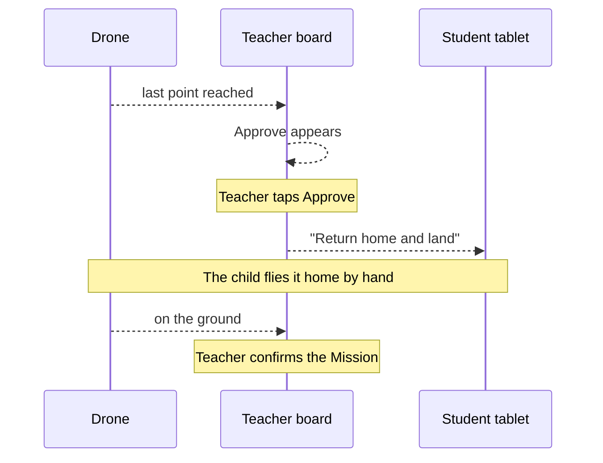

# Make the demo behave like a real lesson

Decided with the product owner on 2026-08-09, in the round that followed
[the eight problems found on a tablet](./2026-08-09-the-eight-from-the-tablet.md).

The theme of this round is one sentence the owner said: *"I want to make sure this demo is
like real in the class."* Everything below follows from that, and the largest finding is that
the board currently opens with drones already in the air that nobody cleared.

## 1. Nothing flies that a Teacher did not clear

**The finding.** The simulator does not do this by itself. It starts every Drone on the
ground, `airborne: false`, `altitudeM: 0`, with a comment reading *"Caller takes them off if
the scenario needs them airborne."* Something else is lifting them: a training scenario or a
demo fixture that seeds a few aircraft flying so the board looks alive.

The result is that the opening shot of the product contradicts the product's own story.

**The order it must follow instead:**

| State | The board |
|---|---|
| Lesson not started | every Drone on the ground, 0.0 m, still |
| Lesson started | still on the ground. Nothing moves |
| Student asks | still on the ground |
| Teacher grants | **that** Drone lifts off. Only that one |
| Flying | it flies its route, points tick off |
| Approved | it returns home and lands |
| Sealed | the score appears |

**After a grant, the Drone flies by itself.** In a demo there is no child, so the simulated
aircraft plays the child's part. The story then tells itself with no hidden controls and no
puppeteering: grant, rise, fly, land, score.

## 2. What flies is decided by who joined

**No Student, no takeoff.** A Drone marked "In this Lesson" with nobody on it never leaves the
ground and never enters the clearance queue. In a real classroom a Drone with no child holding
a controller does not fly, and the queue already works this way: a team enters it when it is
Ready, on a craft and past pre-flight. A Drone with nobody on it is not a team.

So the number of aircraft in the air equals the number of devices that joined and took one.
Two iPads join, two Drones fly. Nobody joins, nothing flies.

**The exception, and it is a real classroom case as much as a demo safeguard:** a Teacher can
**seat a Student by hand**. They tap Drone 3, type "Amira", and she is flying with no tablet.
She simply cannot see her own screen. A broken iPad must not stop a child flying, and the
Teacher taking responsibility out loud is exactly what happens in a room when technology fails.

## 3. How a Student gets on a Drone

Typed once, remembered after that.

```
STEP 1                         STEP 2
┌─────────────────────────┐    ┌─────────────────────────┐
│   Who is using          │    │   Classroom code        │
│   this device?          │    │      ┌───────────┐      │
│  ┌────────┐ ┌────────┐  │    │      │  4 K 9 P  │      │
│  │TEACHER │ │STUDENT │  │    │      └───────────┘      │
│  └────────┘ └────────┘  │    │   Your teacher reads    │
│                         │    │   this out              │
└─────────────────────────┘    └─────────────────────────┘

STEP 3                         STEP 4
┌─────────────────────────┐    ┌─────────────────────────┐
│   What is your name?    │    │  Which Drone are you    │
│  ┌───────────────────┐  │    │  holding?               │
│  │ Amira             │  │    │  ┌───┐ ┌───┐ ┌───┐     │
│  └───────────────────┘  │    │  │ 1 │ │ 2 │ │▒3▒│     │
│  Typed once. This       │    │  ┌───┐ ┌───┐ ┌───┐     │
│  tablet remembers you   │    │  │ 4 │ │ 5 │ │ 6 │     │
└─────────────────────────┘    └─────────────────────────┘
                                  ▒3▒ taken, cannot be tapped
```

The Drone number, not a name from a list of thirty, because the child is checking against a
**physical object in their hands**. Six large buttons beat thirty small ones, and two children
reaching for Drone 3 are standing next to each other, so they find out in a second.

The Teacher's board fills itself as children join, and the Teacher can change any row in one
tap. **The Teacher's change always wins.**

## 4. When a screen goes quiet

Nothing tracks liveness today. A child whose iPad died looks identical to a child flying
happily, and a Student who rejoins from another device cannot take their own Drone back,
because their old seat still holds it and it is greyed out.

- **Both sides send a heartbeat.** The Teacher's board says "Drone 3, not heard from for 40
  seconds". The Student's tablet says it has lost the board rather than showing frozen numbers
  as though they were live, which is the rule about absent readings applied to a whole screen.
- **A Student can reclaim their own Drone**, and the Teacher can free any seat in one tap.

Already safe and needing no work: closing the tab, the device turning off, the browser
crashing. Both sides save to the device and come back. What is not safe is a **different**
machine, because the Teacher's records live in one browser. That question is parked while the
demo runs on Vercel.

## 5. The Scope

**No-fly Zones draw in all three views, not only Top-down.**

The code today refuses Side and Front, reasoning that *"a horizontal boundary would look like
it had a vertical extent nobody drew"*. That argument is now wrong: a No-fly Zone has no
ceiling, and you cannot fly over the netting at 3 metres either. So the zone genuinely is a
full-height column of air, and hiding it on the Side view is the less honest choice. A Teacher
watching Side today sees a Drone sail through a zone with nothing on screen to say so.

```
TOP-DOWN                 SIDE (today)          SIDE (decided)
┌──────────────┐         ┌──────────────┐      ┌──────────────┐
│  ▨▨▨         │         │              │      │ ▨▨▨          │
│  ▨▨▨    ●    │         │       ●      │      │ ▨▨▨   ●      │
│         ●    │         │   ●          │      │ ▨▨▨ ●        │
└──────────────┘         └──────────────┘      └──────────────┘
```

**Zones drawn outside the window must be said, not silently hidden.** The Scope draws a fixed
window of space, not the whole world. A zone placed at 40 metres when the window is 8 metres
across is real and invisible. The Lesson screen must say so rather than letting a Teacher draw
something they will never see.

**The starting point must be drawn.** `web/lib/home-point.ts` exists and works, and is used in
exactly two places, both of which print it as **words**. Nothing draws it on the Scope. So a
Teacher can read where a Drone's home is but never see it, on the one screen where it would
mean something.

```
┌────────────────────────────────┐
│      ⌂ ╌╌╌╌╌╌╌╌╌ ●             │  ⌂ where Drone 1 took off
│      1            1            │  ● where it is now
│      ⌂            ⌂            │  ╌╌ where Recall would send it
│      2            3            │
└────────────────────────────────┘
```

The dotted line matters because **Recall is one of only five commands that reach an aircraft**.
A Teacher should be able to see where a Drone is about to fly before pressing it, rather than
pressing and hoping.

## 6. How a flight ends

Played out as it would happen in the room:

> Amira's Drone reaches the last point.
> The Teacher glances at the board and sees Alpha has everything.
> The Teacher says out loud: "Team Alpha, bring it home."
> Amira flies it back with her hands and lands it on her pad.
> The Teacher sees it is down and confirms.



**The Teacher never presses Recall to end a flight.** Recall is what you press when something
is wrong and a child cannot fix it. Using it to finish a normal flight would be like ending a
lesson with the fire alarm.

In the demo the simulated aircraft plays the child's part and flies home by itself after the
approval. Nothing else changes.

## 7. The demo, staged

| Choice | Decision | Why |
|---|---|---|
| Mission length | **2 minutes**, a genuinely short Mission | Nobody watches a dot for eight minutes. Speeding the clock up would make a reading lie, which this product refuses to do anywhere else |
| Aircraft in the air | **However many joined**, no fixed number | Honest, and it shows the relationship between one child and one aircraft |
| Trouble | **One scripted incident**, mid-flight: a Drone drifts toward a No-fly Zone | Otherwise step 10 stays empty and the entire Emergency workflow is invisible. Random trouble would fire while the presenter is explaining something else |
| Recall | **Used once**, during that incident | It is the only honest place for it, and it is the moment that proves the board controls something |

The persuasive ninety seconds is a Drone drifting, a warning turning a child's tablet red, and
a Teacher pulling it back. That is worth more than any slide about safety.

## The prompt

```
Make the simulated Fleet obey the lesson. Every decision below is made; do not
stop to ask.

1. NOTHING IS AIRBORNE THAT A TEACHER DID NOT CLEAR.
   The simulator starts Drones on the ground; something else lifts them, a
   training scenario or a demo fixture. Find it and stop it. Before the Lesson
   starts, and after it starts, every Drone reads 0.0 m and still. A Drone
   leaves the ground only when a Teacher grants that Drone's takeoff.

2. AFTER A GRANT, THAT DRONE FLIES ITSELF. It climbs, flies its route and
   reaches its points. In a demo there is no child, so the simulated aircraft
   plays the child's part. No hidden control, nothing for a presenter to press.

3. NO STUDENT, NO TAKEOFF. A Drone in the Lesson with nobody on it never flies
   and never enters the clearance queue. The number in the air equals the
   number of devices that joined and took one.

4. A TEACHER CAN SEAT A STUDENT BY HAND. Tap the Drone, type the name, that
   child is flying with no tablet. A broken iPad must not stop a child flying.

5. THE STUDENT JOIN FLOW: classroom code, then their name typed once and
   remembered on that device, then they tap the Drone NUMBER they are holding.
   Taken Drones are greyed out and untappable. The board fills itself. The
   Teacher can change any row and the Teacher's change wins.

6. HEARTBEAT BOTH WAYS. The board says "Drone 3, not heard from for 40
   seconds". The Student tablet says it has lost the board rather than showing
   frozen numbers as live. A Student can reclaim their own Drone; the Teacher
   can free any seat in one tap.

7. NO-FLY ZONES DRAW IN ALL THREE VIEWS, as a full-height band on Side and
   Front. A No-fly Zone has no ceiling, so hiding it on an elevation view is
   the dishonest choice. This changes the reasoning in ADR-0019; write the ADR.

8. SAY WHEN A ZONE IS OUTSIDE THE WINDOW. The Scope draws a fixed window of
   space. A zone drawn beyond it is real and invisible, and the Lesson screen
   must say so.

9. DRAW THE STARTING POINT. web/lib/home-point.ts already tracks it and only
   ever prints it as words. Put a home marker under every Drone on the Scope,
   and a dotted line from an airborne Drone to its own home, so a Teacher can
   see where Recall goes before pressing it.

10. HOW A FLIGHT ENDS. Every point reached, Approve appears on the Teacher's
    board, the Teacher taps it, the Student's tablet says "return home and
    land", the child flies it home, Telemetry sees it down, the Teacher
    confirms. The Teacher never presses Recall to end a normal flight.

11. THE DEMO MISSION IS TWO MINUTES. A genuinely short Mission, not a sped-up
    clock. No reading may lie.

12. ONE SCRIPTED INCIDENT mid-flight: a Drone drifts toward a No-fly Zone, the
    Alert fires, the Student's tablet turns red and says "move away" in the
    same words the rules used, and the Teacher recalls it. This is the only
    place Recall appears in the demo.

PROVE IT BY WALKING IT. Open the board, join a Student on a second device,
and walk the whole lesson end to end. If anything is in the air before you
granted it, the first item is not done.

Gate is npm test and npm run typecheck.
```
