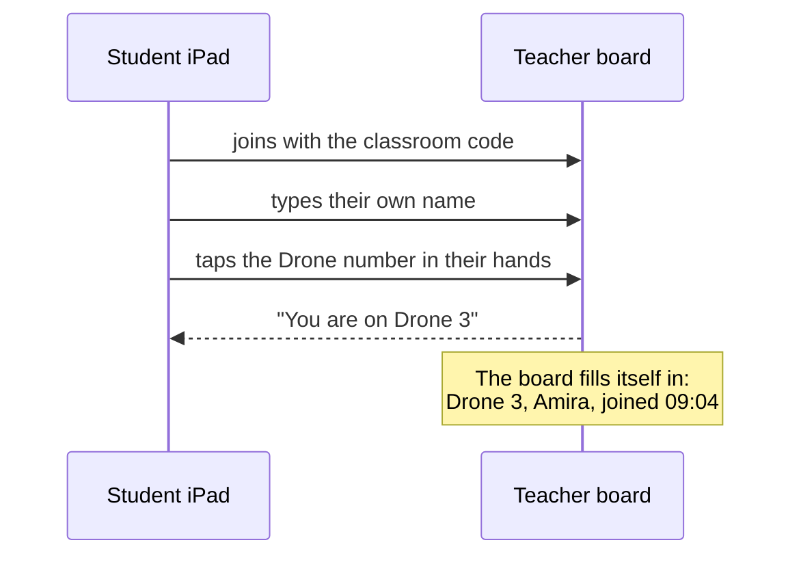
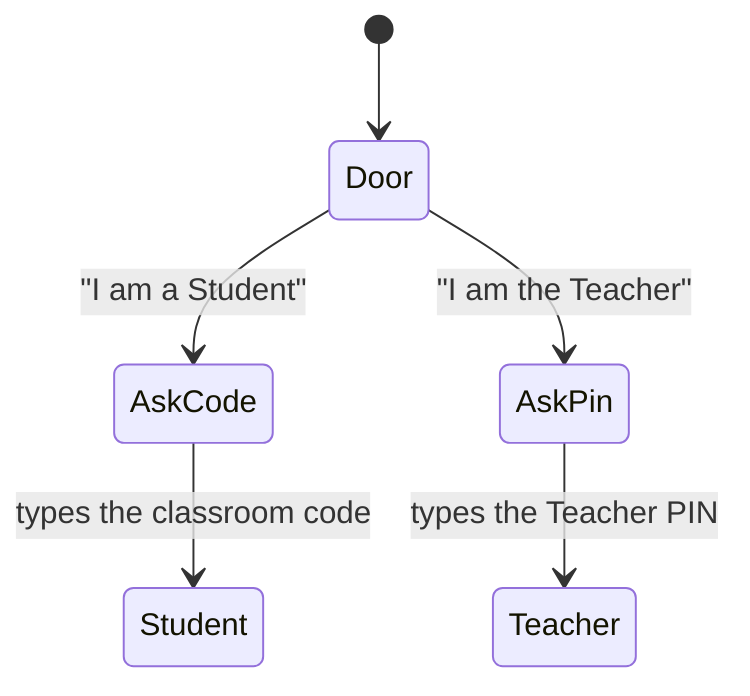

# The eight problems found on a real tablet

Decided with the product owner on 2026-08-09, after they opened the deployed board on an
iPad and an iPhone for the first time. Every cause below was traced in the code, not
guessed.

This is the first round of findings that came from **using** the product rather than
reading it. All eight are things a laptop screenshot could never have shown.

## The eight, and what causes each

| # | Problem | Cause |
|---|---|---|
| 1 | Ugly on iPad and iPhone | Never tested at phone width. Every screenshot to date was laptop-sized |
| 2 | Wall of text on the Student screen | The **Teacher's** own twenty-line briefing checklist is printed for children. `MissionBriefing.tsx:84` |
| 3 | "You do not have a Drone yet" | Correct but useless. Nobody was assigned; the board shows "No Student" on every Drone |
| 4 | No Student login or logout | Never built |
| 5 | Students can reach the Teacher board | A **Switch role** button sits in the header of every page. Two taps from a child to Land and Stop |
| 6 | The door screen is ugly | Left aligned, small type, two boxes of different colours and different weights |
| 7 | No way back to the Mission from Walls | The Mission link was deliberately removed from the menu and left only on **Ctrl + K**, which does not exist on a tablet |
| 8 | The Go to menu is messy | It sits in the centre of the header, and its panel opens over the status bar beneath it |

Number 5 is the most serious. The safety story told to a school is that no child can press
anything that moves an aircraft. Today a child can reach those buttons in two taps.

## The decisions

### How a Student gets onto a Drone

The Student picks **the Drone number painted on the aircraft in their hands**, not their name
from a list of thirty. Six large buttons checked against a physical object, rather than a
long list checked against memory.



- **The Student picks; the Teacher can change any row in one tap.** No roster to prepare
  before class. The board fills while the Teacher is busy handing out aircraft.
- **A Drone already taken is greyed out and untappable**, so two children cannot land on one.
- **The Student's name stays on screen, large, for the whole lesson.** A child looking at
  someone else's name for forty minutes will say so. This is the fix for a mistap, rather
  than a PIN.
- **No Student PIN.** The stakes are a wrong name in a record, not a stolen account, and the
  Teacher is three metres away with a board that shows every seat.

Known hole, accepted: a child taps the Drone of a classmate who is absent. Nothing greys
out, because nobody is competing for it. The Teacher's board shows an absent child suddenly
flying, which is the check.

### How the app tells a Teacher from a Student

Today it does not. It only remembers which button was tapped, and `Switch role` lets anyone
change their mind.



| Role | Secret | Who knows it |
|---|---|---|
| Student | the classroom code | everyone, the Teacher reads it out |
| Teacher | a four digit PIN | the Teacher alone, never spoken in the room |

**The Student secret is public on purpose. The Teacher secret is private on purpose.** Half of
this already exists and works: the classroom code. The PIN is the missing half.

Recommended alongside, and it needs no code from us: **iPad Guided Access**, which locks a
tablet to one page until the Teacher enters their device passcode. It is the only measure a
curious ten year old genuinely cannot defeat, and it also keeps children out of Safari and
YouTube during a lesson.

### Unlimited Drones

`MAX_CLASSROOM_FLEET_SIZE` is 20 today. The owner's instruction is unlimited: the Teacher
adds as many as they like.

Remove the cap from the data. The screens still need a number to be **designed** for:

| Drones | The board |
|---|---|
| 6 | comfortable |
| 20 | full but readable |
| 50 | strips scroll off screen, the map is a crowd |
| 200 | nobody can supervise this |

**Above roughly 24, the flight strips become a compact list.** Adding Drone 47 works; it
simply will not all be visible at once, because no screen can show that and stay glanceable.

### What a Student reads

**Three rules, never twenty.** The Teacher picks the three that matter today; the rest stay on
the Teacher's board, which is where they are read from anyway.

**The three rules must use the same words as the warnings that follow.** If the screen says
"stay out of red" at the start, the warning mid-flight says "move away from red", not
"no-fly zone violation detected".

### Devices

**Everything works on everything**, including the full Teacher board on a phone. On a phone
the rail becomes a drawer, the strips stack and the map shrinks.

### The door

One line, centred, two identical boxes, one word in each, no small grey explanation beneath.
Equal space above and below.

```
┌────────────────────────────────────────────────────┐
│                                                    │
│           Who is using this device?                │
│                                                    │
│     ┌──────────────┐    ┌──────────────┐          │
│     │   TEACHER    │    │   STUDENT    │          │
│     └──────────────┘    └──────────────┘          │
│                                                    │
└────────────────────────────────────────────────────┘
```

Same words on every device; the type shrinks on small screens rather than the wording
changing. On a phone the two boxes stack and stay identical.

### The header and the Go to menu

The menu is in the centre of the header, which is why it reads as wrong before you even
notice the overlap. Navigation does not belong in the middle.

- **Move Go to beside the logo, on the left.**
- **Mission run goes first in the list**, which fixes being stranded on Walls.
- **The panel never covers anything.** The status bar sits below it, not behind it.
- **On a tablet or phone it becomes a full sheet** with large targets, because a small
  dropdown is hard to hit with a thumb.
- **The logo goes home to the Mission**, so the instinctive tap works too.

**Nothing in the header may wrap.** Settings currently falls onto a second row on a narrow
screen, which is why it appears in a strange corner. On small screens the controls fold into
the same sheet; on a laptop they stay as they are, but Settings becomes a proper control
rather than loose grey text beside three pill buttons.

## The prompt

```
Nine changes from the owner opening the deployed board on an iPad and an
iPhone. Every decision is made; do not stop to ask.

1. THE STUDENT JOIN FLOW.
   A Student joins with the classroom code, types their own name, then taps the
   Drone NUMBER they are physically holding. Not a name from a list of thirty.
   The Teacher's board fills itself in as children join. A Drone already taken
   is greyed out and untappable. The Teacher can change any row in one tap, and
   the Teacher's change always wins.
   This replaces the "No Student" dropdown as the primary way a seat is filled;
   keep the dropdown as the Teacher's override.

2. THE STUDENT'S NAME STAYS ON SCREEN, large, for the whole lesson. It is the
   fix for a mistap. No Student PIN.

3. ROLES ARE SECRETS, NOT A CHOICE.
   Student: the classroom code, which is public and read out loud. Teacher: a
   four digit PIN set once in Settings, private, never spoken. The door asks for
   the matching secret before letting anyone through. Remove Switch role from
   the Student chrome entirely; on the Teacher side it must ask for the PIN.
   Say on the Settings screen that iPad Guided Access is the stronger lock, and
   how to turn it on.

4. UNLIMITED DRONES. Delete MAX_CLASSROOM_FLEET_SIZE. Above 24 the flight
   strips become a compact list rather than full strips; the board must stay
   usable at 50 and must not fall over at 200.

5. THREE RULES ON THE STUDENT SCREEN, never twenty. MissionBriefing.tsx:84 is
   the Teacher's checklist and must not be printed for children. The three must
   use the same words as the warnings that follow them.

6. EVERY SCREEN WORKS ON EVERY DEVICE, phone included. The rail becomes a
   drawer, the strips stack, the map shrinks. Nothing in the header may wrap.

7. THE DOOR: one centred line, two identical boxes, one word each, no grey
   subtitle. Same words on every device; the type shrinks on small screens.

8. THE HEADER: Go to moves to the left beside the logo. Mission run goes first
   in its list. The panel sits below the header and never covers the status bar.
   On tablet and phone it becomes a full sheet. The logo links to the Mission
   run. On small screens the controls fold into the same sheet; on a laptop
   Settings becomes a proper control instead of loose text.

9. THE LOGO GOES HOME. Tapping it returns to the Mission run from anywhere.

PROVE IT WITH PICTURES. This whole list exists because every screenshot ever
taken of this product was laptop-sized. Build with NEXT_PUBLIC_DEMO_ONLY=1 and
shoot every screen at 390 (phone), 820 (tablet portrait), 1180 (tablet
landscape) and 1280, in both themes, with TTF_SHOT_ROLE set for both roles. A
fix you have not photographed at 390 wide is not done.

Gate is npm test and npm run typecheck.
```

## Still open

- The remaining rounds of this kind. Nothing here was found by reading the code; it was found
  by holding the product. Every future round should start the same way.
- One real lesson, which has still never happened.
