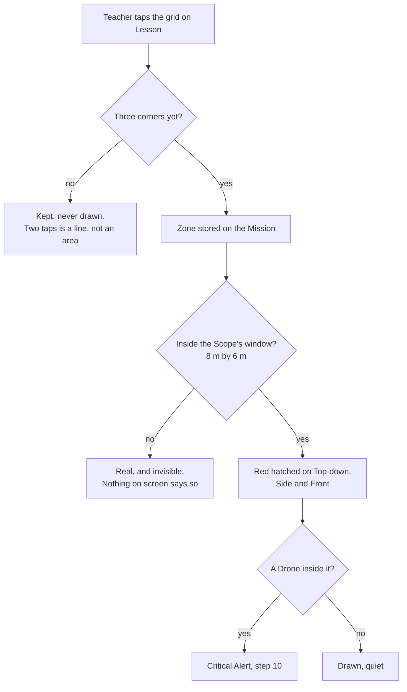

# The cloud, the code, the colours, and a zone nobody can see

Decided with the product owner on 2026-08-11, from a session on a laptop and a phone.

Eight items. One is not a code problem at all and is blocking every other device.

## 1. The classroom cloud is down. Not a code problem

```
GET  /api/classroom  →  500
PUT  /api/classroom  →  500
{"error":"Vercel Blob: Failed to fetch blob: 403 Forbidden"}
```

`BLOB_READ_WRITE_TOKEN` still exists on the project, five days old, and the storage is
refusing it. **On 7 August this same call returned 200.** So the store has been deleted,
rotated or disconnected since.

The message the board showed, *"Could not reach the classroom cloud"*, was telling the truth.
Nothing in the app is broken, and no code change will fix it.

**Owner action, on the Vercel dashboard:** Storage, then reconnect or recreate the Blob store,
which issues a fresh token. This is why no second device can join.

## 2. The classroom code stays

Asked, considered, kept. Dropping it would mean **anyone opening the website joins the live
class**, which for a room full of named children is not a trade worth making for convenience
on one laptop. The code is the only thing between a classroom and the internet.

## 3. Alerts live on step 10 alone. The owner's ruling, with the risk written down

The board currently repeats the **whole Alerts panel** on step 6, cards and buttons and "2 more
in the queue". That is not the pinned bar the plan intended, and the owner is right that it
breaks "one thing at a time".

**Decided: nothing on any step except step 10.**

> **The risk, stated once and overruled:** a Drone enters a No-fly Zone while the Teacher is on
> step 8 reading telemetry. Nothing tells them. The Alert waits on a step they are not looking
> at, while children fly real aircraft. The fleet-wide Land all, Hover all and Stop all remain
> on every step, so a Teacher can still stop everything instantly once they know. What they
> lose is *knowing*.

This is recorded so that if it bites in a real lesson, the decision is findable rather than
mysterious.

## 4. Change classroom, and leave, are different words

The owner was stuck on "What is your name?" with no route to the code. There is a way out, but
it reads as final and discards the name.

- **"Change classroom"** goes straight to the code screen and **keeps the name**. This is what
  a Teacher testing, or a tablet moving between periods, actually needs.
- **"Leave"** stays as it is, for a child going home.

## 5. The name list shows the room, not the device's history

Today it lists every name ever typed on that tablet. The owner's screen showed five, from five
different lessons: *bleble, cia, rey, super lok, taskeen*. That list only grows, and by
December a child would hunt for themselves among a hundred strangers.

**Decided: it shows everyone in this classroom.** Names already taken on another device stay
visible but cannot be tapped, and say why.

```
┌─────────────┐  ┌─────────────┐  ┌─────────────┐
│    Amira    │  │    Josh     │  │    Sara     │
└─────────────┘  └─────────────┘  └─────────────┘

┌─────────────┐  ┌─────────────┐
│░░░  Ben  ░░░│  │░░░  Lily ░░░│   already on another device
└─────────────┘  └─────────────┘
```

**Same rule as the Drone picker**, deliberately. A child learns one behaviour, not two.

## 6. Three colours, three meanings, none shared

The classroom boundary is drawn in the brand orange. It is the only coloured thing on the
Scope, it never changes, and it trains a Teacher's eye to ignore orange. Then a real Alert
arrives in the same colour.

**Decided, and it matches the customer's own poster**, where Mission Zones are blue dashed and
No-fly Zones red hatched:

| Colour | Meaning |
|---|---|
| **Blue dashed** | the classroom wall. Context |
| **Red hatched** | No-fly Zone. Keep out |
| **Orange** | something needs you. Nothing else |

## 7. A zone that exists and cannot be seen. Defect

The rail reads **"2 no-fly zones"**. The Scope's key reads only *"Filled = flying"* and
*"Dashed box = classroom boundary"*. Since the last wave made that key computed from what is
actually drawn, the key is now proof: **nothing hatched is being drawn at all.**

The zones exist in the Mission and never reach the screen.

### Where a zone can vanish, drawn out



**Two places a zone disappears silently**, and the owner has hit at least one of them. The
likely cause is the second: the area editor and the Scope may not agree on where things are,
so a zone drawn in the editor lands outside the window the Scope draws. That agreement is what
the coder must check first.

## 8. The Student app on a phone and an iPad

Tidy it. This was asked plainly and is not a question: every Student screen must look
deliberate at 390 and at tablet widths, not merely fit.

## The prompt

```
Eight items. Every decision is made; do not stop to ask. If you meet an
ambiguity genuinely not covered, choose whichever option puts FEWER WORDS on a
screen, record it in docs/DECISIONS.md, and continue.

NOT YOURS: the classroom cloud returns 500 with "Vercel Blob: 403 Forbidden".
The token exists and the store is refusing it. That is a dashboard action by
the owner, not a code change. Do not try to fix it, and do not work around it.

1. ALERTS LIVE ON STEP 10 ALONE.
   Step 6 currently repeats the whole Alerts panel, cards and buttons and "2
   more in the queue". Remove it from every step but 10. The fleet-wide Land
   all / Hover all / Stop all stay on every step, unchanged.
   This reverses the pinned-Attention decision from ADR-0030. Write the ADR,
   and write the cost into it plainly: a Teacher on step 8 will not learn that
   a Drone entered a No-fly Zone until they visit step 10. That risk was
   stated to the owner and overruled. Record it so it is findable, not
   mysterious.

2. CHANGE CLASSROOM, SEPARATE FROM LEAVE.
   "Change classroom" goes straight to the code screen and KEEPS the name.
   "Leave" stays as it is. Today the only route to the code discards the name
   and reads as final, which is why the owner was stranded on "What is your
   name?".

3. THE NAME LIST IS THE ROOM, NOT THE DEVICE'S HISTORY.
   Today it lists every name ever typed on that tablet; the owner's showed five
   from five different lessons and it only grows. Show everyone in THIS
   classroom. A name already taken on another device stays visible, cannot be
   tapped, and says why. Same rule as the Drone picker, so a child learns one
   behaviour.

4. THREE COLOURS, THREE MEANINGS.
   Classroom boundary: BLUE dashed, using the info token, not the brand orange.
   No-fly Zone: RED hatched. Orange means something needs you, and nothing
   else. This matches the customer's own poster, where Mission Zones are blue
   dashed and No-fly Zones red hatched.
   Right now the boundary is the only coloured thing on the Scope and it never
   changes, which trains a Teacher to ignore the colour an Alert arrives in.

5. A ZONE THAT EXISTS AND IS NOT DRAWN. Defect, and the important one.
   The rail reads "2 no-fly zones" while the Scope's key reads only "Filled =
   flying" and "Dashed box = classroom boundary". Since that key is computed
   from what is drawn, it proves nothing hatched reaches the screen.
   Check first whether the Mission area editor and the Scope agree on
   coordinates: a zone drawn in the editor may be landing outside the 8 m by 6
   m window the Scope draws. Then check the three-corner rule.
   Whichever it is, a zone that cannot be seen must SAY so, on the Lesson
   screen and on the Scope. A silently invisible No-fly Zone is a safety
   feature that looks present and is not.

6. THE STUDENT APP ON A PHONE AND AN IPAD. Every Student screen must look
   deliberate at 390 and at tablet widths, not merely fit. Shoot all of them.

7. LessonScreen reads the team list once per render, so getting a team onto the
   Mission needs a page reload before "Put these craft on the Mission" appears.
   Flagged in the last wave and left. Fix it here.

8. Keep the classroom code. It was questioned and kept: without it, anyone who
   opens the site joins the live class.

PROVE IT BY RUNNING IT
  - Draw two No-fly Zones on the Lesson, then look at the Scope. If the key
    does not name a hatch, item 5 is not done.
  - Open the Student app at 390 and walk every screen.
  - Take a name on one device and confirm it is visible and blocked on another.
Shoot at 390, 820, 1180 and 1280, both themes, both roles.

Gate is npm test and npm run typecheck.
```
