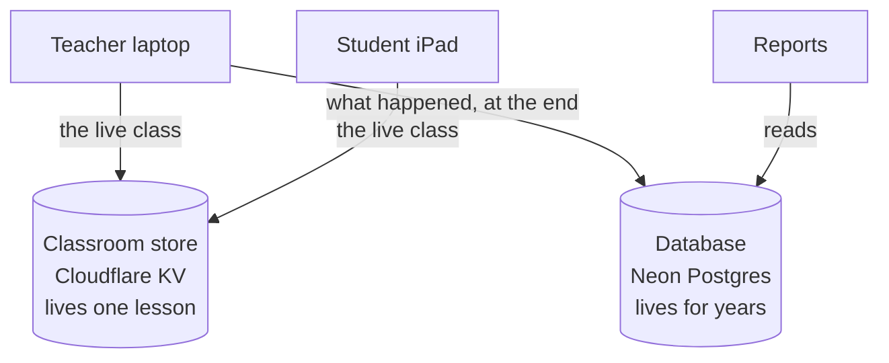
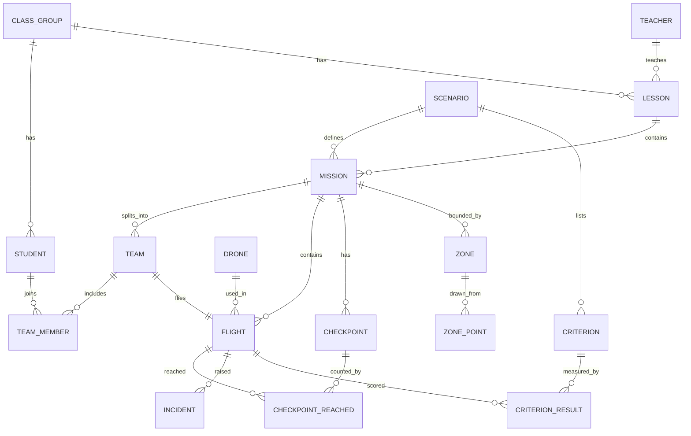

# A store that never sleeps, a database at last, and Large format goes

Decided with the product owner on 2026-08-12, after the classroom cloud died and the cause
turned out to have nothing to do with the code.

## 1. Why the classroom cloud died, and it was never a bug

```
/api/classroom  →  500   {"error":"Vercel Blob: Failed to fetch blob: 403 Forbidden"}
```

Traced to the account, not the app:

```
techtechflight-classroom   ● Suspended     Billing State: Inactive
techtech-proposals         ● Suspended
conscioustravel-pdfs       ● Suspended
```

**All three Blob stores suspended at once, for inactive billing.** The token was fine, the
code was fine, and the board's message *"Could not reach the classroom cloud"* was true. This
is why no second device could join between 9 and 12 August.

**The owner will not add a payment method.** So the store moves.

### Where it moves to, and why

The owner's requirement, in their words: **"I want runs every time."**

| | Sleeps? | Card? | Account already owned |
|---|---|---|---|
| **Cloudflare Workers + KV** | **Never** | No | **Yes**, the domain is there |
| Supabase | Yes, pauses after ~a week idle and waits for a click | No | No |
| Vercel Blob | Suspended right now | Yes | Yes |

**Decided: Cloudflare.** Supabase was considered seriously and rejected on one point: it pauses
by design, and the owner has just lost days to storage that switched itself off silently. The
symptom on screen would be identical to the failure they are trying to escape.

The classroom holds **5.42 KB**. Cloudflare's free tier is 100,000 reads and 1,000 writes a
day, which this cannot approach.

**Blocked on the owner running two commands:** `npm i -g wrangler` then `wrangler login`.
Everything after that is the coder's.

## 2. Large format goes

Issue #623 has sat unruled since the beginning: it asked for icons only and for Large format
removed, and the guidance given afterwards said keep it. **The owner has now ruled: remove
it.** Half of #623 already shipped, the icon-only header. This closes the other half.

## 3. The database

The owner wants a real relational database in third normal form. **This reverses a recorded
decision**, and the reversal has to be written down rather than assumed:

> `CLAUDE.md` says: *Do not invent a Postgres school DB.* That rule exists because central
> records of children bring obligations a laptop-only product does not have: who may see them,
> how long they are kept, what happens when a parent asks for deletion. The owner has decided
> to take that on. The ADR must say so plainly, so a school is told the truth rather than the
> old sentence.

### Two stores, two jobs, and they must not be confused



**The database does not fix the iPad, and the store does not hold records.** Both are needed
and neither substitutes for the other.

### Which one is the truth

**The browser stays the record; the database is the copy.** A school hall with poor wifi still
has to teach a lesson, and a teacher who cannot mark attendance because the connection dropped
is a real failure with children in the room. The lesson runs offline and syncs when it can.

This is the shape `logbook-sync` already half implements, so it is a completion rather than a
rewrite.

### Where it is hosted

**Neon.** Free, no card, and unlike Supabase it **wakes itself** when a request arrives rather
than waiting for someone to click. Free plan, checked on 2026-08-12: 0.5 GB storage per
project, 100 compute-hours a month, 100 projects, 5 GB egress, sleeps after 5 minutes idle and
resumes on the next request in about half a second.

For text records of a school's lessons, none of those are near.

### The schema

Every fact in one place. A Drone's label lives only in `drone`; a Student's name lives only in
`student`; everything else points at them.



```sql
create table school      (id uuid primary key, name text not null);

create table teacher     (id uuid primary key,
                          school_id uuid not null references school(id),
                          name text not null);

create table class_group (id uuid primary key,
                          school_id uuid not null references school(id),
                          name text not null);

create table student     (id uuid primary key,
                          class_id uuid not null references class_group(id),
                          name text not null);

create table drone       (id uuid primary key,
                          school_id uuid not null references school(id),
                          label text not null,
                          serial text,
                          unique (school_id, label));

create table scenario    (id uuid primary key,
                          name text not null,
                          objective text not null,
                          limit_minutes int not null);

create table criterion   (id uuid primary key,
                          scenario_id uuid not null references scenario(id),
                          text text not null);

create table lesson      (id uuid primary key,
                          class_id uuid not null references class_group(id),
                          teacher_id uuid not null references teacher(id),
                          label text not null,
                          started_at timestamptz not null,
                          ended_at timestamptz);

create table mission     (id uuid primary key,
                          lesson_id uuid not null references lesson(id),
                          scenario_id uuid not null references scenario(id),
                          started_at timestamptz not null,
                          sealed_at timestamptz);

create table team        (id uuid primary key,
                          mission_id uuid not null references mission(id),
                          name text not null);

create table team_member (team_id uuid not null references team(id),
                          student_id uuid not null references student(id),
                          primary key (team_id, student_id));

create table zone        (id uuid primary key,
                          mission_id uuid not null references mission(id),
                          kind text not null,
                          name text not null);

create table zone_point  (id uuid primary key,
                          zone_id uuid not null references zone(id),
                          ordinal int not null,
                          east_m numeric not null,
                          north_m numeric not null,
                          unique (zone_id, ordinal));

create table checkpoint  (id uuid primary key,
                          mission_id uuid not null references mission(id),
                          ordinal int not null,
                          east_m numeric not null,
                          north_m numeric not null,
                          unique (mission_id, ordinal));

create table flight      (id uuid primary key,
                          mission_id uuid not null references mission(id),
                          team_id uuid not null references team(id),
                          drone_id uuid not null references drone(id),
                          took_off_at timestamptz,
                          landed_at timestamptz);

create table checkpoint_reached (flight_id uuid not null references flight(id),
                          checkpoint_id uuid not null references checkpoint(id),
                          reached_at timestamptz not null,
                          primary key (flight_id, checkpoint_id));

create table incident    (id uuid primary key,
                          flight_id uuid not null references flight(id),
                          kind text not null,
                          happened_at timestamptz not null,
                          note text);

create table criterion_result (flight_id uuid not null references flight(id),
                          criterion_id uuid not null references criterion(id),
                          met boolean not null,
                          primary key (flight_id, criterion_id));
```

### Why the awkward tables exist

**`zone_point` is separate** because a zone has many corners. Storing them as
`corner1, corner2, corner3` breaks the moment someone draws four, and that is the classic
third-normal-form mistake.

**`team_member` is its own table** because a team holds several students and a student joins
several teams across a year. Neither side can hold the other.

**`checkpoint_reached` is its own table** because it records *when*. Storing "3 of 5" on the
flight throws away which three.

**`criterion_result` hangs off `flight`, not `mission`**, so two teams flying the same Mission
score differently. That is the point of scoring.

### What is deliberately absent

**No altitude, no battery, no position.** Live readings never enter the database. It holds what
happened, not what is happening, which is the same line the product already draws between the
board and the records.

### What a Teacher sees

Two screens, because records answer only two questions.

```
RECORDS                                    Year 8  ▾
─────────────────────────────────────────────────────
  Amira Rahman        14 flights    4h 12m    ●●●○
  Josh Bennett         9 flights    2h 48m    ●●○○
  Sara Lim            14 flights    4h 05m    ●●●●
─────────────────────────────────────────────────────
                tap a name  ↓

AMIRA RAHMAN                              Year 8
─────────────────────────────────────────────────────
  11 Aug   Search and Rescue    Met 3 of 4    22 min
  04 Aug   Delivery             Met 4 of 4    18 min
  28 Jul   Building Inspection  Met 2 of 4    25 min

  1 incident:  no-fly breach, 04 Aug, recalled
─────────────────────────────────────────────────────
```

## The prompt

```
Three groups. Every decision is made; do not stop to ask. If you meet an
ambiguity genuinely not covered, choose whichever option puts FEWER WORDS on a
screen, record it in docs/DECISIONS.md, and continue.

BACKGROUND YOU NEED. The classroom cloud has been returning 500 since about 9
August. It is not a bug. All three of the owner's Vercel Blob stores are
suspended for inactive billing, and the owner will not add a payment method.
Do not try to fix Vercel Blob.

════════════════════════════════════
A. THE CLASSROOM STORE MOVES. Urgent: nothing else the owner reports can be
   tested until a second device can join.
════════════════════════════════════

1. MOVE THE CLASSROOM STORE TO CLOUDFLARE WORKERS + KV.
   Same shape as api/classroom.ts today: GET and PUT one JSON per classroom
   code. The owner will have run `wrangler login` on this machine.
   Requirements: it must NEVER sleep or pause. That is the whole reason for
   choosing it over Supabase, which pauses after about a week idle and waits
   for a human to click. The owner's words were "I want runs every time".
   Keep api/classroom.ts working as a fallback so the Vercel path still works
   if billing is ever restored, and point classroomApiUrl() at whichever is
   configured.
   The classroom is 5.42 KB. Free tier is 100k reads and 1k writes a day.

2. WHEN THE STORE IS UNREACHABLE, SAY WHICH STORE AND WHY.
   Today the board says "Could not reach the classroom cloud". That was true
   for three days and told nobody anything actionable. Name the failure.

════════════════════════════════════
B. LARGE FORMAT GOES.
════════════════════════════════════

3. REMOVE LARGE FORMAT ENTIRELY. Issue #623 asked for it, guidance afterwards
   said keep it, and the owner has now ruled: remove. Delete
   DisplayScaleToggle, the display-scale storage key, the data-display
   attribute and every style that hangs off it. Update
   docs/DELIBERATE-POSITIONS.md, which currently defends keeping it.

════════════════════════════════════
C. THE DATABASE. Not urgent, and it does not fix the iPad.
════════════════════════════════════

4. WRITE THE ADR FIRST, BEFORE ANY SCHEMA.
   CLAUDE.md says "Do not invent a Postgres school DB". The owner has reversed
   that. The ADR must say plainly what the reversal takes on: central records
   of children bring obligations a laptop-only product does not have, and the
   sentence a school is told changes from "the records are on your own laptop"
   to something else. Write the new sentence.

5. THE BROWSER STAYS THE RECORD; THE DATABASE IS THE COPY.
   A school hall with poor wifi still has to teach a lesson. A teacher who
   cannot mark attendance because the connection dropped is a real failure with
   children in the room. logbook-sync already half implements this shape;
   finish it rather than rewriting it.

6. HOSTED ON NEON. Free, no card, and it wakes itself on the next request
   rather than waiting for a click, which is why it and not Supabase. Checked
   2026-08-12: 0.5 GB per project, 100 compute-hours a month, sleeps after 5
   minutes idle and resumes in about half a second.

7. THE SCHEMA IS IN THIS DOCUMENT, in third normal form, with the CREATE TABLE
   statements. Build it as written. The three tables that look awkward are
   deliberate and the reasons are written beside them: zone_point, team_member
   and checkpoint_reached each exist because folding them into their parent
   loses information.

8. NO LIVE READINGS IN THE DATABASE. No altitude, no battery, no position. It
   holds what happened, never what is happening. Same line the product already
   draws between the board and the records.

9. THE RECORDS SCREEN IS TWO SCREENS: a class list, and one child's history.
   The layout is in this document. Records answer two questions and no more.

PROVE IT BY RUNNING IT
  - Join a Student from a second device against the new store. If a second
    device cannot join, item 1 is not done, whatever the tests say.
  - Confirm nothing anywhere still reads the display-scale key.
Gate is npm test and npm run typecheck.
```
