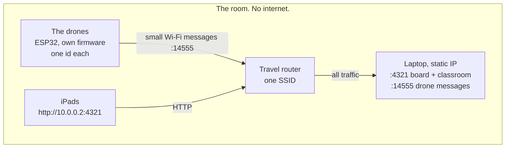
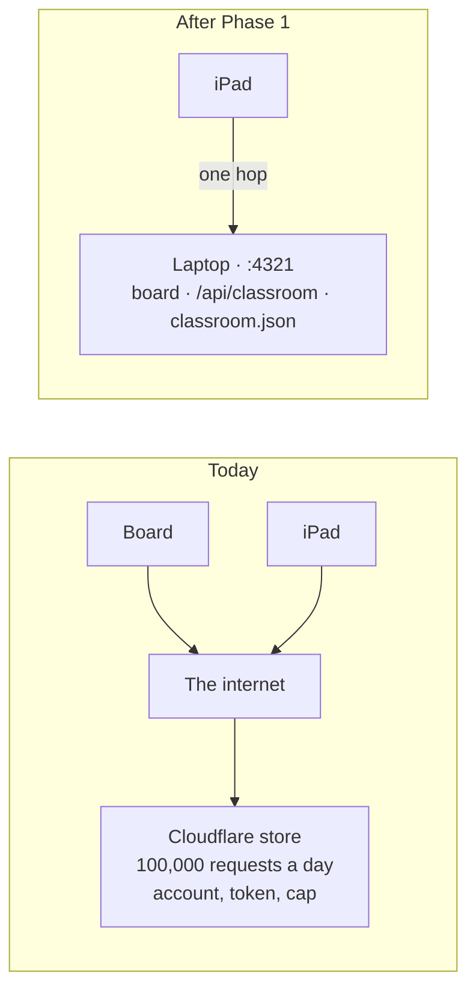
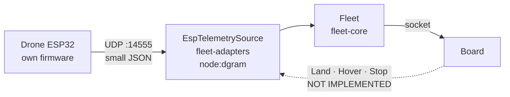
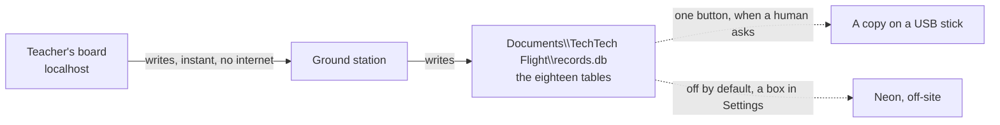

# The local flight deck: one laptop, one switch, the school's own drones

2026-08-17. Rewritten the same day after grilling the owner: the first draft assumed MAVLink
and that assumption was wrong. The school's drones are **DIY, built on ESP32, with firmware
written in-house, signalling over Wi-Fi**. MAVLink is a standard for bought flight controllers
and is not this project's path. The adapter stays in the tree for anyone who ever wants it.

Written after a week in which nothing about teaching broke and everything about hosting did:
Blob suspended for billing, a Cloudflare login that could not complete, a free-plan request cap
hit account-wide in a day. This plan takes the classroom off the internet entirely.

**The goal, in the owner's words:** something ready to plug in, in one setup.

---

## 0. What is known, and what is not

| | |
|---|---|
| Aircraft | DIY, ESP32, firmware written by the school's drone team |
| Radio | Wi-Fi. Nothing is plugged into the laptop |
| Message format | **The drone team decides.** This project adapts |
| MAVLink | Not the path. Not needed. Not deleted |
| **The dangerous unknown** | **Whether the aircraft transmits anything back at all** |

That last row governs everything in Phase 3. The board is built on the aircraft talking back:
battery, height, position, airborne, points reached. A one-way link — handset to aircraft,
nothing returning — means every live reading reads *not reporting* forever, and no code fixes
it. Ask the drone team before Phase 3 is scheduled. The three questions are in §8.

---

## 1. The kit

| Item | What it does | Cost |
|---|---|---|
| Travel router | The classroom's own network. Fixed SSID, so devices and drones find it without school IT | ~£25 |
| The laptop | Ground station on `:4321`. Serves the board, holds the classroom, listens for the drones | owned |
| The drones | Already carry an ESP32 with Wi-Fi. **Nothing to add to them** | the drone team's |
| iPads | The children's screens, joined to the same router | owned |



**Why a router rather than the school Wi-Fi.** An ESP32 cannot join WPA-Enterprise, which is
the username-and-password kind nearly every school runs. Client isolation then blocks the iPads
from reaching the laptop, and a captive portal blocks both. Three walls, none of them arguable
with on the morning of a lesson. The drones need an ordinary WPA2 network with a fixed name and
password, and that is what £25 buys.

---

## 2. Phase 0 — prove the network. No code.

Everything below assumes an iPad can reach the laptop. If it cannot, the answer is a router,
not a rewrite.

- Laptop and iPad on one network. `ipconfig` for the laptop's address.
- On the iPad, open `http://<laptop-ip>:4321`. The board loads, or it does not.
- Try it on the school network **and** on the router. Write down which worked.
- Give the laptop a static address on the router. The board's URL then never changes and can be
  printed on a card taped to the trolley.

---

## 3. Phase 1 — the classroom store moves into the ground station

The store is about ninety lines of Worker code. It moves to `ground-station/src/server.ts` as
`GET/PUT /api/classroom`, backed by a JSON file beside `classroom-source.json`.



### Work

1. **Port the merge, do not rewrite it.** The Worker settles seats on `rev`, seat by seat, ties
   to the store's copy, and refuses nothing. The ground station runs the same rules.
   `web/standards.test.ts` already refuses two runtimes drifting apart — extend it to a third.
   **Never settle any of it on `updatedAt`:** a board and a tablet do not share a clock, and
   that is the bug that made a correct tablet invisible for three days.
2. **Persist to disk.** A crash mid-lesson must not lose who is on which Drone.
3. **Default to same origin when the board was served by a ground station.** The built-in
   Cloudflare URL stays for the hosted copies; `techtechflight:classroom-sync-url` stays as the
   override.
4. **Slow the poll.** Every device asking every 2.5 s is what emptied the Cloudflare allowance:
   thirty iPads is 43,200 requests an hour. Back off when nothing has changed, and do not poll
   at all before a Mission starts.
5. **Fix two lies on the classroom code panel.** It names `BLOB_READ_WRITE_TOKEN`, dead since
   2026-08-12, and it says "not configured" when it means "the store refused me". A Teacher
   cannot tell those apart, and that hid a broken sync for three days.

### Not in scope

The Logbook. It stays in the browser and the Neon copy stays the copy (ADR-0034).

---

## 4. Phase 2 — one switch

- One `.bat`: ground station up, real Fleet selected, board opened on `localhost`.
- It prints the iPad address and renders a QR for it. Nobody types an IP in front of a class.
- **The board runs on `localhost`, not the LAN address.** `getUserMedia` is refused on a plain
  `http://` address that is not localhost, so the camera breaks in a way that reads as a
  permissions bug.
- **No demo fallback.** With no Fleet connected the board says so. It must not quietly simulate
  one and look like it is working.

---

## 5. Phase 3 — the open door

Not MAVLink. **A door on the laptop that accepts small Wi-Fi messages**, so that whatever the
drone team builds can reach the board without this project depending on their decisions.

**Build it now rather than waiting for the drone team.** An earlier draft held this back until
they answered whether the aircraft transmits anything at all. That was the wrong call: the door
makes no assumption about their radio, their handset or their naming, so their answer cannot
waste it. If the aircraft turns out to say nothing, the door sits there harmlessly and the board
honestly reads *not reporting* — which is what it would do anyway. The question is still worth
asking (§8), it simply no longer blocks anybody.



### The packet

One object per aircraft per tick, roughly 2 Hz. Only `id` is required.

```json
{ "id": "drone-3", "battery": 0.74, "height": 2.1, "east": 1.2, "north": -0.4, "airborne": true }
```

Ten lines on their side, no library:

```cpp
udp.beginPacket(LAPTOP_IP, 14555);
udp.printf("{\"id\":\"drone-3\",\"battery\":%.2f,\"height\":%.2f}", batt, alt);
udp.endPacket();
```

### Rules the door obeys

- **Every field except `id` is optional, and absent means "cannot report".** Never a zero. The
  contract already distinguishes absent from null and the board already says both in words.
- **An id the Fleet does not know is not invented into existence.** Registration comes from
  config, the way the ground station registers a set today, so a stray packet cannot add an
  aircraft to a Teacher's board mid-lesson.
- **Silence is said out loud.** Last-heard drives *not reporting*; readings are never frozen and
  shown as though current.
- **Malformed packets are dropped quietly**, size-capped, and never crash the ground station. A
  classroom full of half-written firmware is the normal case, not the edge case.
- The sender's address is remembered per id. Phase 4 needs somewhere to send a reply.

### Why this cannot be wasted work

It assumes nothing about the drone team's radio, handset, or naming. If they invent their own
format, somebody writes a thirty-line translator. If they surprise everyone and use MAVLink,
that adapter is already in the tree. It is testable with no aircraft in the room: send packets
from the laptop itself and watch the board.

---

## 5b. Phase 3½ — the records move onto the laptop, and the cloud goes off

Decided 2026-08-18 with the owner, after asking why a cloud appeared in a plan whose whole
point is that nothing leaves the room. It should not have. **The database is a file on the
laptop and the cloud is switched off.**



### Why this changes a written rule, and the rule it changes

ADR-0034 says the browser is the record and the database is the copy. That was right when the
database was in the cloud: a lesson must never wait on a network. It is wrong once the database
is a file on the same machine, because there is no network to wait on, and because browser
storage has a failure the file does not: **clearing browsing data destroys the records, silently
and completely.** A file can also be copied to a USB stick, which is what a school actually does
with anything it cares about.

**Write ADR-0035 before the code.** State what changes, and what a school is now told about
where their children's records live.

### Work

1. The eighteen tables of `db/schema.sql`, created in a SQLite file at
   `Documents\TechTech Flight\records.db`. `node:sqlite` is built into Node 24 — no dependency,
   no install, no server, verified on the owner's machine.
2. **The ground station writes it, at lesson boundaries.** Never per telemetry tick. **No live
   readings ever:** no altitude, no battery, no position. Coordinates only on `zone_point` and
   `checkpoint`, because those are what a Teacher *set*.
3. The browser keeps its copy so the board still works with the ground station closed, and the
   file wins when they disagree. A board opened on a *hosted* copy has no ground station behind
   it, falls back to the browser, and syncs when it is next opened on the laptop.
4. **The Neon push stays in the codebase and defaults off.** No account, no connection, no
   credential. A box in Settings turns it on for a school that wants off-site backup.
5. Two buttons on Settings, so no Teacher is told a file path: *Save a copy of my records* — a
   dated file on the Desktop — and *Export for a spreadsheet*.

**The cost, stated plainly:** local-only makes backup a human habit. If the laptop is lost and
nobody pressed the button, the records are gone. That is the honest price of no cloud, no
account and no bill, and the switch is there when a school decides the price is too high.

---

## 5c. The demonstration seed — how a Teacher sees all twelve steps

The rail locks a step until its condition holds: *Choose a Scenario first*, *Grant a takeoff
first*, *Nothing has flown yet*. That is the product guiding somebody, and it must not be
removed to make a demo easier.

What is missing is a way to **fill** a lesson rather than unlock an empty one. One button in
Settings, or a flag on the launcher: seed a Scenario, zones, teams on craft, pre-flight ticked,
a Lesson started, children joined, flights flown and points reached. Every step then opens
because its condition genuinely holds, and every panel shows real content.

- It writes the same records any lesson writes. Nothing is faked and no screen is special-cased.
- **It must be impossible to seed into a real class.** A seeded Lesson is labelled as a
  demonstration in the record, and the button refuses to run when the roll holds real children.
- It is how the owner shows a boss the whole product on a laptop, and how anybody reviews a
  screen that is otherwise three lessons deep.

---

## 6. Phase 4 — commands that really work

Its own ADR, after Phase 3 has flown. Phases 1 to 3 need no undoing: Phase 4 is a new
implementation of an existing seam, `CommandableSource`, which the simulator satisfies and
hardware does not (ADR-0011). Owning both ends of the wire makes this *simpler* than MAVLink
would have been — the drone team defines what a command looks like — and no easier to make safe.

**Answer these in the ADR before any code:**

- **What does Stop mean in the air?** Cutting motors makes a drone fall. Above a class of
  children that is worse than the problem it solves. Stop probably has to mean *land now* — and
  then the word on the button is wrong and must change.
- **What happens when the message is lost?** UDP does not deliver reliably. The Teacher pressed
  Land. Did it land? The board must not claim an outcome it cannot see, so a command needs an
  acknowledgement or the screen has to stay honest about not knowing.
- **What if the child is still on the sticks?** Two inputs, one aircraft. Decide who wins, and
  make it the same answer every time.
- **What if the wrong aircraft answers?** Two drones flashed with the same id is a Command
  reaching the wrong child's aircraft. Ids must be unique and checked.

---

## 7. What must not break

- Students never get a Command. Exactly two pressable things on the tablet (ADR-0025).
- Phases derive from records and Telemetry, never from a press.
- No invented readings. Absent is said in words, never a zero and never a dash.
- No GPS, no map tile. Metres from the Fleet's own origin (ADR-0019).
- The browser stays the record; the database is the copy (ADR-0034).

---

## 8. Send these three to the drone team

Nothing in Phase 3 can be scheduled until these are answered. They are deliberately short.

1. **Does the drone send anything back to the ground — battery, height, position — or does the
   link only go from the controller to the aircraft?** If nothing comes back, the Teacher's
   board can show the lesson but never a live reading.
2. **If it does send something back: what does the message look like, and how often?** Any
   format is workable. We need one example packet and the rate.
3. **Can each aircraft carry a fixed id that never changes** (drone-1, drone-2 …), so the board
   can tell six identical airframes apart?

A useful thing to offer them, even though they decide: *"send this to the laptop on UDP 14555 at
2 Hz and it will work"*, with the packet and the ten lines above. Concrete beats asking someone
to choose.

---

## 9. Before any of it: the tracker is wrong

**389 issues are open. Three were sampled and all three are already shipped:** #628 the
classroom code syncing board to phones, #640 the Student's request-takeoff step, #636 holding a
takeoff rather than only granting it. Work has been shipping without anybody closing anything.

This is not tidiness. It is the reason a wave of work in this repo rebuilt four items that were
already on `main`: nobody could tell finished from outstanding, so it was guessed. A backlog
that lies costs more than an empty one.

**The sweep, and it comes first because everything else is planned from its output.**

- Take the open issues in batches. For each, look at the code, not at the issue's own claims.
- Already shipped: close it, with one line naming where it lives now. Do not reopen the design
  argument — a shipped thing that is wrong is a *new* issue, not an old one left open.
- Genuinely outstanding: keep it, and add one line saying what is missing today.
- Cannot tell in two minutes: label `needs-info` and move on. Do not stall the sweep on one
  issue.
- Anything the sweep contradicts in the docs (a gotcha that describes a fixed bug, a plan that
  describes shipped work) gets corrected in the same pass.

Output is a table: closed, kept, unclear. **That table is the real backlog**, and the first
honest answer to "what is left before this app is complete".

`HANDOFF.md` is part of the same problem. It still reads as a to-do list for the ten fixes,
every one of which is merged. The next person to read it is misled on their first page.

---

## 10. The deploy nobody should have to do by hand

The Cloudflare board is a manual `wrangler deploy`. It sat on the 12 August build for three days
while `main` moved on, because a manual step only happens when a human with a token remembers
it, and the OAuth login on this machine has never once completed.

Store one API token as a GitHub secret, add a workflow that deploys both Workers on every push
to `main`, and the Cloudflare copy updates itself exactly as the Vercel copy already does.
About twenty lines. It removes a class of failure that cost most of a working day.

---

## 10b. Getting it onto a laptop, and keeping it up to date

"Ready to plug in, in one setup" has a hole in it that no amount of app work closes: **somebody
has to get the app onto the machine first.** Today that means installing Node.js and copying a
folder, and the launcher's own first line is a check that Node exists with instructions to go
and fetch it. That is fine for the owner and wrong for a school technician who was handed a
trolley.

Nothing here is hard. It is unglamorous and it is the difference between a product and a
project.

- **One folder, copied.** No repository clone, no `git`, no build tools assumed. A zip a
  technician unzips to `C:\TechTech Flight` and nothing else.
- **Node, decided.** Either the zip carries a Node runtime beside the app so nothing is
  installed at all, or the setup notes name one version and one download. Carrying it is
  friendlier and larger; naming it is smaller and leans on somebody following instructions.
  **Recommendation: carry it.** A school technician should never see a version number.
- **First run does everything.** Installs what it needs, builds the board, creates the records
  file, starts, opens. The launcher already does most of this; it must not fail differently on
  a machine that has never seen it.
- **Updates are a replaced folder, and the records survive it.** This is the part that must be
  designed rather than discovered: `records.db` lives in Documents precisely so that replacing
  the app folder cannot touch it. Say so in the setup notes, and never put data in the app
  folder.
- **A page of setup notes a technician can follow**, with the router, the static address, the
  iPads and Guided Access on it. §7 is most of that text already.

---

## 11. What "done" looks like

The owner has asked "is it complete yet" repeatedly and the plan never answered, because it
listed work rather than a finish line. Two finish lines, and the first one is reachable without
the drone team, without hardware, and without anybody else's permission.

### Done A — the demonstration. Nothing outside this project is needed.

- [ ] Double-click the launcher on a laptop that has never run it. It installs, builds, starts,
      and opens the board without a single typed command.
- [ ] Settings shows **Simulator**, and the board flies a class of simulated Drones.
- [ ] The demonstration seed fills a Lesson, and **all twelve steps open** and show real content.
- [ ] A phone or iPad on the same network joins with the code and sits on the Student screen.
- [ ] The network cable comes out and the whole thing carries on working.
- [ ] Step 11 seals a Mission; step 12 shows the logs and the debrief.
- [ ] Records shows the class list; a name opens that child's history.
- [ ] *Save a copy of my records* produces a file on the Desktop.

That is a product a Teacher can be shown, and a boss can be walked through, on one laptop in a
room with no internet.

### Done B — a real lesson. Needs the drone team.

- [ ] Settings shows **real drones**, and the board reads at least one real aircraft.
- [ ] Every live reading is either a real number or the words that say it is absent. No zeros
      standing in for readings nobody sent.
- [ ] A child takes off, flies points, and the board ticks them off from what the aircraft says.
- [ ] The Lesson ends, the records are written, and the file holds it the next morning.

**Land and Stop reaching an aircraft are not on either list**, deliberately. Children fly by
hand and a Teacher calls out, which is what a room does today.

---

## 12. Who does what

| | |
|---|---|
| **The coder** | Everything in §2 to §5c, §9 and §10. Nothing on that list is blocked by anybody |
| **The owner** | Run Phase 0 on an iPad. Send §8 to the drone team. Read ADR-0035 and overrule it if it is wrong |
| **The drone team** | Answer §8. Nothing else, and nothing waits on them |
| **Operational, today** | Rotate the Cloudflare API token that was pasted into a chat window on 2026-08-14 |

**The hosted copies stay.** Vercel deploys itself and the Cloudflare board deploys itself once
§10 is done. They are for showing somebody the product without carrying a laptop, and they cost
nothing to keep once neither needs a human to remember a command.

---

## 13. Still the owner's to decide

| Decision | Blocks |
|---|---|
| Router, or the school network. Test it, buy the router anyway | Phase 0 |
| How many aircraft in one lesson | board layout, message rate |
| Whether iPads need the camera. If yes, the laptop needs a certificate the iPads trust | Phase 2 |
