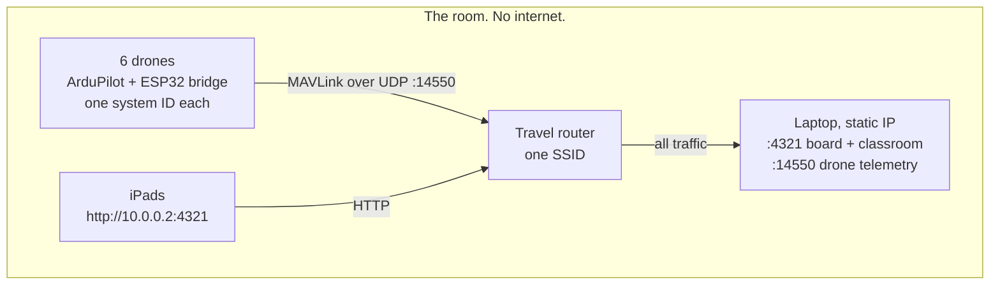
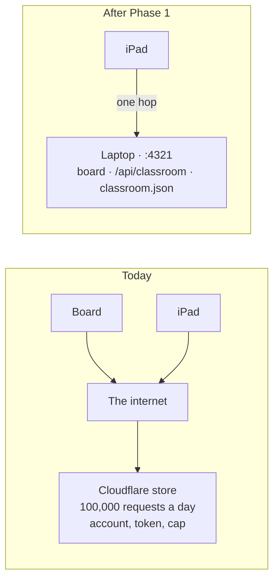
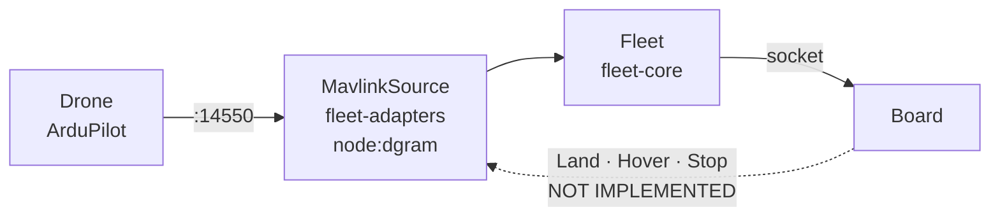

# The local flight deck: one laptop, one switch, real drones

2026-08-17. Written after a week in which nothing about teaching broke and everything about
hosting did: Vercel Blob suspended for billing, a Cloudflare login that could not complete, and
a free-plan request cap hit account-wide in a day. None of that is the product. This plan takes
the classroom off the internet entirely.

**The goal, in the owner's words:** something ready to plug in, in one setup. Switch on, one
file, the room is ready.

---

## 1. The kit

| Item | What it does | Cost |
|---|---|---|
| Travel router | The classroom's own network. Fixed SSID, so devices and drones find it without school IT | ~£25 |
| The laptop | Ground station on `:4321`. Serves the board, holds the classroom, reads the drones | owned |
| ESP32 Wi-Fi bridge, one per drone | Flight controller telemetry port to MAVLink over UDP | ~£5 each |
| iPads | The children's screens, joined to the same router | owned |

**Why a router rather than the school Wi-Fi.** An ESP32 bridge cannot join WPA-Enterprise,
which is the username-and-password kind nearly every school runs. Client isolation then blocks
the iPads from reaching the laptop, and a captive portal blocks both. Three walls, none of them
arguable with on the morning of a lesson.

**Why ArduPilot or PX4 rather than Betaflight.** MAVLink is the only family where the adapter
in `fleet-adapters` already works, and the only one where a Command has a defined message. A
Betaflight build speaks MSP, is designed for a human in goggles, and closes the door on Phase 4
permanently.

---

## 2. Phase 0 — prove the network. No code.

Everything below assumes an iPad can reach the laptop. If it cannot, the answer is a router,
not a rewrite.

- Laptop and iPad on one network. `ipconfig` for the laptop's address.
- On the iPad, open `http://<laptop-ip>:4321`. The board loads, or it does not.
- Try it on the school network **and** on the router. Write down which worked.
- Give the laptop a static address on the router. The board's URL then never changes and can be
  printed on a card taped to the trolley.

---

## 3. Phase 1 — the classroom store moves into the ground station

The store is about ninety lines of Worker code. It moves to
`ground-station/src/server.ts` as `GET/PUT /api/classroom`, backed by a JSON file beside
`classroom-source.json`.

The change is deleting the middle of the first row. Same board, same tablets, same classroom
code; the document simply stops leaving the room.

### Work

1. **Port the merge, do not rewrite it.** The Worker settles seats on `rev`, seat by seat, ties
   to the store's copy. The ground station runs the same rules. `web/standards.test.ts` already
   refuses the two runtimes drifting apart — extend it to a third rather than dropping it.
2. **Persist to disk.** A crash mid-lesson must not lose who is on which Drone.
3. **Default to same origin when the board was served by a ground station.** The built-in
   Cloudflare URL stays for the hosted copies; `techtechflight:classroom-sync-url` stays as the
   override.
4. **Slow the poll.** Every device asking every 2.5 s is what emptied the Cloudflare allowance:
   thirty iPads is 43,200 requests an hour. On a laptop it is merely wasteful, but the same fix
   serves both — back off when nothing has changed, and do not poll at all before a Mission
   starts.

### Not in scope

The Logbook. It stays in the browser and the Neon copy stays the copy (ADR-0034). A school hall
with poor wifi still has to teach a lesson.

---

## 4. Phase 2 — one switch

- One `.bat`: ground station up, real Fleet selected, board opened on `localhost`.
- It prints the iPad address and renders a QR for it. Nobody types an IP in front of a class.
- **The board runs on `localhost`, not the LAN address.** `getUserMedia` is refused on a plain
  `http://` address that is not localhost, so opening the board at the laptop's own IP breaks
  the camera in a way that reads as a permissions bug.
- **No demo fallback.** With no Fleet connected the board says so. It must not quietly simulate
  one and look like it is working.

---

## 5. Phase 3 — real aircraft, honestly

The dashed edge is drawn because its absence is the design. `CommandableSource` is a seam in the
types: the simulator satisfies it, hardware does not, so a Fleet of real aircraft refuses
Commands **structurally** rather than by somebody remembering to disable a button (ADR-0011).

### Work

- Map each MAVLink system ID to a Drone the board already knows. One laptop, one port, the whole
  class. Duplicated system IDs are a real hazard: two aircraft answering as one.
- Link quality and last-heard, said in words. A Drone that stopped reporting is never frozen
  numbers.
- Commands stay unavailable, and the strip says why.

---

## 6. Phase 4 — commands that really work

Its own ADR, after Phase 3 has flown. Phases 1 to 3 need no undoing: Phase 4 is a new
implementation of an existing seam.

**Answer these in the ADR before any code:**

- **What does Stop mean in the air?** On real hardware it usually means disarm, and a disarmed
  drone falls. Above a class of children that is worse than the problem it solves. Stop probably
  has to mean *land now* — and then the word on the button is wrong and must change.
- **What happens when the radio drops mid-command?** The Teacher pressed Land. Did it land? The
  board must not claim an outcome it cannot see.
- **What if the child is still on the sticks?** Two inputs, one aircraft. Decide who wins, and
  make it the same answer every time.
- **What if the wrong aircraft answers?** A duplicated system ID sends a Command to the wrong
  child's drone.

---

## 7. What must not break

- Students never get a Command. Exactly two pressable things on the tablet (ADR-0025).
- Phases derive from records and Telemetry, never from a press.
- No invented readings. Absent is said in words, never a zero and never a dash.
- No GPS, no map tile. Metres from the Fleet's own origin (ADR-0019).
- The browser stays the record; the database is the copy (ADR-0034).

---

## 8. Open, and only the owner can close them

- **Which flight controller and firmware.** ArduPilot or PX4 gives MAVLink and a future for
  Phase 4. Betaflight gives neither. Blocking for Phase 3.
- **Router or school network.** Test both, buy the router anyway. Blocking for Phase 0.
- **How many aircraft in one lesson.** Sets the board layout and the telemetry rate.
- **Whether iPads need the camera.** If they do, the laptop needs a certificate the iPads trust,
  and that is its own afternoon.
